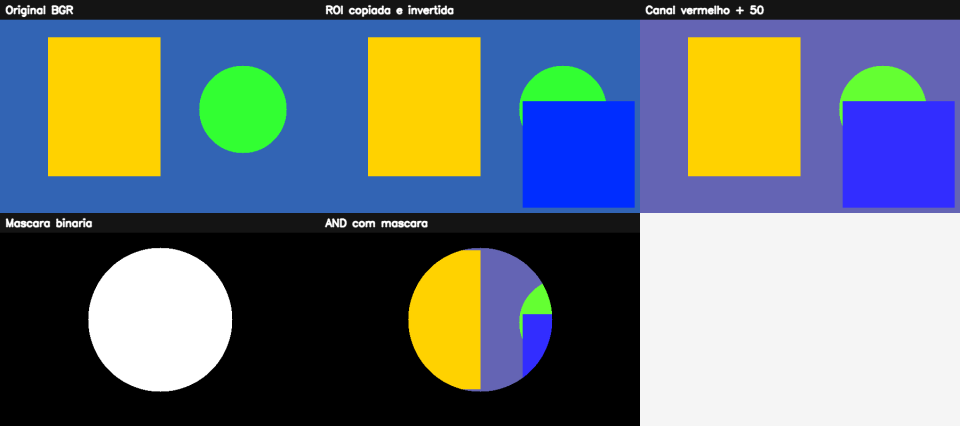

# 1. Imagem digital e OpenCV: fundamentos para começar a enxergar imagens como dados

## O que você aprenderá

Antes de tentar detectar rostos, reconhecer objetos, segmentar uma cena ou usar redes neurais, é necessário dominar uma ideia central: **para o computador, uma imagem é um conjunto organizado de números**.

Ao final deste capítulo, você deverá ser capaz de:

1. explicar o que é uma imagem digital e por que ela pode ser representada por uma matriz;
2. diferenciar **pixel**, **resolução**, **amostragem**, **quantização** e **profundidade de cor**;
3. compreender o sistema de coordenadas usado pelo OpenCV;
4. explicar por que `imagem[y, x]` usa primeiro a linha e depois a coluna;
5. identificar a diferença entre imagens em tons de cinza e imagens coloridas;
6. compreender por que o OpenCV utiliza, por padrão, a ordem de canais **BGR**;
7. carregar, verificar, exibir e salvar imagens com segurança;
8. consultar `shape`, `dtype`, `size` e outras propriedades importantes;
9. acessar e modificar pixels sem cair em erros comuns;
10. entender a diferença entre operações pixel a pixel e operações vetorizadas;
11. extrair e manipular uma **ROI** (*Region of Interest*);
12. compreender a diferença entre uma *view* e uma cópia independente no NumPy;
13. separar, modificar e recombinar canais de cor;
14. criar máscaras binárias;
15. aplicar operações `AND`, `OR`, `NOT` e `XOR`;
16. compreender o problema de *overflow* em `uint8`;
17. construir um pequeno pipeline de processamento de imagens;
18. resolver exercícios conceituais e práticos usando Python, NumPy e OpenCV.

---

## 1.1 Antes de tudo: o computador não “vê” como nós

Quando uma pessoa observa uma fotografia de uma estrada, pode dizer quase imediatamente:

> “Há uma pista, duas árvores, um carro e uma placa.”

O computador não recebe essas ideias prontas. Ele recebe **valores numéricos**.

Essa diferença é fundamental.

### Analogia: o mosaico

Imagine um grande mosaico feito com milhares de pequenos azulejos coloridos.

De longe, você enxerga a figura completa. De perto, percebe que ela é formada por pequenas peças individuais.

Em uma imagem digital:

- o mosaico inteiro corresponde à **imagem**;
- cada azulejo corresponde a um **pixel**;
- a posição do azulejo corresponde às **coordenadas**;
- a cor do azulejo corresponde a um ou mais **valores numéricos**.

Gonzalez e Woods (2010) apresentam a imagem digital como uma função bidimensional cujas coordenadas espaciais e amplitudes são discretizadas. Em uma formulação simplificada, podemos representar uma imagem em tons de cinza por:

\[
I(y,x)
\]

em que:

- `y` representa a linha;
- `x` representa a coluna;
- `I(y,x)` representa a intensidade armazenada naquela posição.

Em uma imagem típica de 8 bits em tons de cinza:

\[
I(y,x) \in \{0,1,2,\ldots,255\}
\]

Assim:

- `0` representa preto;
- `255` representa branco;
- valores intermediários representam diferentes níveis de cinza.

Essa representação discreta é a base do processamento digital de imagens (GONZALEZ; WOODS, 2010).

---

## 1.2 O que é um pixel?

**Pixel** vem de *picture element*, isto é, “elemento de imagem”.

Um pixel é a menor posição individual que tratamos diretamente em uma imagem matricial.

É importante não confundir duas ideias:

- **posição do pixel**: onde ele está;
- **valor do pixel**: qual intensidade ou cor está armazenada naquela posição.

### Exemplo mental

Considere esta pequena matriz:

```text
0    50   100
150  200  255
30   80   120
```

Ela pode representar uma imagem em tons de cinza de apenas `3 × 3` pixels.

O valor `0` seria visualizado como preto.  
O valor `255` seria branco.  
O valor `100` seria um cinza relativamente escuro.

### Exemplo 1 — criando uma pequena imagem manualmente

```python
import numpy as np

imagem_cinza = np.array([
    [0,   50, 100],
    [150, 200, 255],
    [30,  80, 120]
], dtype=np.uint8)

print(imagem_cinza)
print("Formato:", imagem_cinza.shape)
```

Saída esperada:

```text
[[  0  50 100]
 [150 200 255]
 [ 30  80 120]]

Formato: (3, 3)
```

Nesse exemplo, não existe ainda nenhuma “fotografia”. Temos apenas uma matriz de números. Entretanto, esses números podem ser interpretados como intensidades luminosas e exibidos como imagem.

---

## 1.3 Imagem digital é matriz

No OpenCV para Python, uma imagem carregada normalmente é representada por um objeto `numpy.ndarray`.

Isso significa que muitas operações de processamento de imagens são, na prática, **operações sobre matrizes NumPy**.

### Analogia: planilha

Uma imagem em tons de cinza pode ser comparada a uma planilha:

- cada linha da planilha é uma linha da imagem;
- cada coluna da planilha é uma coluna da imagem;
- cada célula contém a intensidade de um pixel.

Uma imagem colorida acrescenta uma “profundidade”: em vez de cada célula conter apenas um número, ela contém três valores de intensidade.

### Imagem em tons de cinza

Formato típico:

```text
(altura, largura)
```

Exemplo:

```text
(480, 640)
```

Significa:

- 480 linhas;
- 640 colunas;
- 480 × 640 = 307.200 pixels.

### Imagem colorida

Formato típico:

```text
(altura, largura, canais)
```

Exemplo:

```text
(480, 640, 3)
```

Significa:

- 480 linhas;
- 640 colunas;
- 3 valores por posição espacial.

Em uma imagem colorida de 8 bits e três canais, cada pixel espacial possui três números.

---

## 1.4 Resolução: quantos “azulejos” formam a imagem?

A **resolução espacial** informa quantas posições de amostragem existem na imagem.

Uma imagem com:

```text
1920 × 1080
```

possui:

\[
1920 \times 1080 = 2.073.600
\]

pixels espaciais.

### Atenção à ordem

Quando falamos de resolução no cotidiano, normalmente dizemos:

```text
largura × altura
```

Por exemplo:

```text
1920 × 1080
```

Entretanto, o atributo `shape` do NumPy normalmente aparece como:

```python
(altura, largura, canais)
```

Logo, uma imagem Full HD colorida normalmente apresentaria:

```python
imagem.shape == (1080, 1920, 3)
```

!!! warning "Um dos erros mais comuns de quem começa"
    `shape` usa a lógica de matrizes: primeiro **linhas**, depois **colunas**.  
    Por isso, `(1080, 1920, 3)` significa 1080 pixels de altura e 1920 pixels de largura.

---

## 1.5 Amostragem e quantização

A formação de uma imagem digital envolve duas discretizações importantes (GONZALEZ; WOODS, 2010).

### Amostragem

A **amostragem** determina quantas posições espaciais serão representadas.

Uma analogia útil é imaginar que você coloca uma grade sobre uma cena.

- grade muito grossa → poucos pontos → menos detalhes espaciais;
- grade mais fina → mais pontos → mais detalhes.

A amostragem está diretamente relacionada à resolução espacial.

### Quantização

A **quantização** determina quantos valores diferentes cada posição pode assumir.

Em uma imagem de 8 bits:

\[
2^8 = 256
\]

níveis são possíveis.

Portanto, em um canal `uint8`, os valores vão de:

```text
0 até 255
```

### Analogia: régua

Imagine duas réguas.

A primeira tem apenas marcações de centímetro.  
A segunda tem marcações de milímetro.

As duas medem a mesma dimensão, mas a segunda oferece mais níveis possíveis de representação.

De maneira semelhante:

- amostragem decide **quantas posições espaciais** temos;
- quantização decide **quantos níveis de intensidade** podemos representar em cada posição.

---

## 1.6 O tipo `uint8`

O tipo mais comum em imagens convencionais é:

```python
np.uint8
```

O nome significa:

- `u`: *unsigned* — sem sinal;
- `int`: inteiro;
- `8`: oito bits.

Com oito bits, temos 256 combinações possíveis:

```text
0 a 255
```

### Exemplo 2 — verificando o tipo

```python
import numpy as np

imagem = np.zeros((100, 200), dtype=np.uint8)

print(imagem.dtype)
```

Saída:

```text
uint8
```

### Por que o tipo de dado importa?

Porque operações matemáticas precisam respeitar o intervalo do tipo.

Veja:

```python
import numpy as np

valor = np.array([250], dtype=np.uint8)
resultado = valor + 20

print(resultado)
```

Dependendo da operação NumPy usada, o valor pode retornar modularmente no intervalo de 8 bits, em vez de simplesmente permanecer em 255.

É como um **hodômetro antigo**:

```text
9999 + 1 -> 0000
```

Para processamento de imagens, muitas vezes queremos **saturação**, não retorno modular.

### Exemplo 3 — adição com saturação no OpenCV

```python
import cv2
import numpy as np

valor = np.array([[250]], dtype=np.uint8)

resultado = cv2.add(valor, 20)

print(resultado)
```

Resultado:

```text
[[255]]
```

O OpenCV limita o valor ao máximo representável. Esse comportamento é chamado de **saturação**.

---

## 1.7 Coordenadas: por que `imagem[y, x]`?

Este é um dos pontos mais importantes do capítulo.

Na geometria cartesiana, aprendemos a escrever um ponto como:

```text
(x, y)
```

Entretanto, uma matriz é acessada como:

```text
[linha, coluna]
```

Como:

- linha corresponde à direção vertical → `y`;
- coluna corresponde à direção horizontal → `x`;

temos:

```python
imagem[y, x]
```

### Analogia: prédio

Imagine um prédio:

- `y` indica o **andar**;
- `x` indica a **porta daquele andar**.

Para localizar um apartamento, você primeiro escolhe o andar e depois a posição horizontal.

Uma matriz funciona de maneira semelhante:

```python
imagem[linha, coluna]
imagem[y, x]
```

### Sistema de coordenadas de imagens

A origem normalmente está no canto superior esquerdo:

```text
(0, 0)
```

O eixo `x` cresce para a direita.  
O eixo `y` cresce para baixo.

Isso é diferente do plano cartesiano tradicional, no qual normalmente desenhamos `y` crescendo para cima.

Bradski e Kaehler (2008) destacam a importância de compreender a representação matricial e a convenção de coordenadas usada nas operações do OpenCV.

!!! important "Duas convenções convivem no mesmo programa"
    Para acessar a matriz usamos `imagem[y, x]`.  
    Para várias funções geométricas do OpenCV, como `cv2.circle`, o ponto é fornecido como `(x, y)`.

### Exemplo 4 — acessando um pixel

```python
import numpy as np

imagem = np.zeros((100, 200, 3), dtype=np.uint8)

x = 50
y = 20

pixel = imagem[y, x]

print(pixel)
```

---

## 1.8 BGR: a ordem de canais do OpenCV

Em muitas bibliotecas e contextos gráficos, usamos a ordem:

```text
RGB
```

isto é:

1. Red;
2. Green;
3. Blue.

O OpenCV historicamente utiliza, por padrão, a ordem:

```text
BGR
```

isto é:

1. Blue;
2. Green;
3. Red.

(BRADSKI; KAEHLER, 2008).

### Analogia: três torneiras

Imagine três torneiras que misturam luz:

- torneira azul;
- torneira verde;
- torneira vermelha.

No OpenCV, escrevemos a intensidade nessa ordem:

```python
[B, G, R]
```

### Exemplo 5 — cores puras em BGR

```python
azul = [255, 0, 0]
verde = [0, 255, 0]
vermelho = [0, 0, 255]
branco = [255, 255, 255]
preto = [0, 0, 0]
```

Portanto:

```python
imagem[y, x] = [0, 0, 255]
```

faz o pixel ficar **vermelho**, não azul.

---

## 1.9 Criando uma imagem sintética

Antes de depender de arquivos externos, é útil aprender a criar imagens diretamente na memória.

### Exemplo 6 — fundo preto

```python
import numpy as np

imagem = np.zeros((400, 600, 3), dtype=np.uint8)
```

Interpretação:

```text
400 -> altura
600 -> largura
3   -> canais BGR
```

Todos os valores começam em zero, portanto a imagem é preta.

### Exemplo 7 — fundo colorido

```python
imagem = np.zeros((400, 600, 3), dtype=np.uint8)

imagem[:, :] = [180, 100, 50]
```

O trecho:

```python
imagem[:, :]
```

significa:

> selecione todas as linhas e todas as colunas.

Assim, todos os pixels recebem a mesma cor BGR.

### Desenhando formas

```python
import cv2
import numpy as np

imagem = np.zeros((400, 600, 3), dtype=np.uint8)

cv2.rectangle(
    imagem,
    (80, 60),       # canto superior esquerdo: (x, y)
    (280, 300),     # canto inferior direito: (x, y)
    (0, 200, 255),  # cor BGR
    -1              # preenchido
)

cv2.circle(
    imagem,
    (450, 200),     # centro: (x, y)
    80,             # raio
    (50, 255, 50),  # cor BGR
    -1
)
```

Observe novamente a diferença:

```python
imagem[y, x]
```

mas:

```python
cv2.circle(imagem, (x, y), ...)
```

---

## 1.10 Carregando uma imagem do disco

A função básica para leitura é:

```python
cv2.imread(caminho, flag)
```

### Exemplo 8 — leitura colorida

```python
import cv2

imagem = cv2.imread("foto.jpg", cv2.IMREAD_COLOR)
```

### Flags comuns

| Flag | Resultado |
|---|---|
| `cv2.IMREAD_COLOR` | carrega imagem colorida em BGR |
| `cv2.IMREAD_GRAYSCALE` | carrega em um canal de tons de cinza |
| `cv2.IMREAD_UNCHANGED` | preserva canais existentes, inclusive alfa quando disponível |

### Um erro clássico

Isto é perigoso:

```python
imagem = cv2.imread("foto_que_nao_existe.jpg")
print(imagem.shape)
```

Se o arquivo não for carregado, `imread` pode retornar `None`.

Então:

```python
imagem.shape
```

falhará.

### Exemplo 9 — leitura segura

```python
import cv2

caminho = "foto.jpg"
imagem = cv2.imread(caminho, cv2.IMREAD_COLOR)

if imagem is None:
    raise FileNotFoundError(
        f"Não foi possível abrir a imagem: {caminho}"
    )

print("Imagem carregada com sucesso.")
print("Shape:", imagem.shape)
```

### Analogia: encomenda

`cv2.imread()` é como pedir uma encomenda.

Você não deve começar a usar o conteúdo da caixa antes de verificar se a caixa realmente chegou.

O teste:

```python
if imagem is None:
```

faz essa verificação.

---

## 1.11 Exibindo uma imagem

Em programas desktop, podemos usar:

```python
cv2.imshow("Janela", imagem)
cv2.waitKey(0)
cv2.destroyAllWindows()
```

### O papel de cada função

```python
cv2.imshow(...)
```

solicita a criação da janela.

```python
cv2.waitKey(0)
```

mantém o programa aguardando uma tecla.

```python
cv2.destroyAllWindows()
```

fecha as janelas criadas pelo OpenCV.

### Exemplo 10 — ciclo básico de exibição

```python
import cv2

imagem = cv2.imread("foto.jpg")

if imagem is None:
    raise FileNotFoundError("A imagem não foi encontrada.")

cv2.imshow("Minha imagem", imagem)
cv2.waitKey(0)
cv2.destroyAllWindows()
```

!!! note "Ambientes sem interface gráfica"
    Em servidores, alguns ambientes de notebook e execuções automatizadas, `cv2.imshow()` pode não ser apropriado. Nesses casos, salvar a imagem com `cv2.imwrite()` ou usar a ferramenta de visualização do ambiente costuma ser mais adequado.

---

## 1.12 Salvando uma imagem

A função:

```python
cv2.imwrite(nome_do_arquivo, imagem)
```

codifica a matriz no formato indicado pela extensão do arquivo.

### Exemplo 11

```python
import cv2
import numpy as np

imagem = np.zeros((200, 300, 3), dtype=np.uint8)
imagem[:] = [0, 0, 255]

sucesso = cv2.imwrite("imagem_vermelha.png", imagem)

print("Arquivo salvo?", sucesso)
```

### Pipeline básico

Um grande número de programas de Visão Computacional segue esta lógica:

```text
arquivo -> leitura -> matriz -> processamento -> matriz -> gravação
```

ou:

```python
imagem = cv2.imread("entrada.jpg")

# processamento
resultado = ...

cv2.imwrite("saida.jpg", resultado)
```

---

## 1.13 Conhecendo a imagem com `shape`, `dtype`, `size` e `ndim`

Antes de processar uma imagem, devemos saber com que dados estamos trabalhando.

### `shape`

```python
print(imagem.shape)
```

Imagem colorida:

```text
(altura, largura, canais)
```

Imagem em cinza:

```text
(altura, largura)
```

### `dtype`

```python
print(imagem.dtype)
```

Exemplo:

```text
uint8
```

### `size`

```python
print(imagem.size)
```

Retorna o número total de **elementos numéricos**, não necessariamente o número de pixels espaciais.

Uma imagem:

```text
400 × 600 × 3
```

tem:

```text
720.000 elementos numéricos
```

mas:

```text
240.000 posições espaciais de pixel
```

### `ndim`

```python
print(imagem.ndim)
```

- imagem cinza típica → `2`;
- imagem BGR típica → `3`.

### Exemplo 12 — relatório de metadados

```python
import cv2

imagem = cv2.imread("foto.jpg")

if imagem is None:
    raise FileNotFoundError("Arquivo não encontrado.")

print("shape:", imagem.shape)
print("dtype:", imagem.dtype)
print("size:", imagem.size)
print("ndim:", imagem.ndim)

if imagem.ndim == 3:
    altura, largura, canais = imagem.shape
    print("Altura:", altura)
    print("Largura:", largura)
    print("Canais:", canais)
else:
    altura, largura = imagem.shape
    print("Altura:", altura)
    print("Largura:", largura)
    print("Imagem de um canal")
```

---

## 1.14 Acesso direto a pixels

### Imagem em tons de cinza

```python
valor = imagem_cinza[y, x]
```

O retorno é um único valor.

### Imagem BGR

```python
pixel = imagem_colorida[y, x]
```

O retorno contém três intensidades.

Exemplo:

```python
b, g, r = imagem_colorida[y, x]
```

### Exemplo 13 — lendo o pixel central

```python
altura, largura = imagem.shape[:2]

centro_x = largura // 2
centro_y = altura // 2

pixel = imagem[centro_y, centro_x]

print(
    f"Pixel central em (x={centro_x}, y={centro_y}):",
    pixel
)
```

---

## 1.15 Modificando pixels: faça primeiro para entender, depois faça melhor

Para aprender, é válido alterar um pixel individual.

```python
imagem[20, 50] = [0, 0, 255]
```

Entretanto, processar uma imagem inteira com laços Python aninhados costuma ser muito menos eficiente do que utilizar operações vetorizadas do NumPy e rotinas otimizadas do OpenCV (MARQUES FILHO; VIEIRA NETO, 1999).

### Forma didática, mas lenta

```python
for y in range(100):
    for x in range(100):
        imagem[y, x] = [0, 0, 255]
```

### Forma vetorizada

```python
imagem[0:100, 0:100] = [0, 0, 255]
```

As duas ideias podem produzir o mesmo resultado, mas a segunda delega a operação a mecanismos muito mais eficientes.

### Analogia: pintar uma parede

Imagine pintar uma parede de duas maneiras.

**Método 1:** usar um cotonete e pintar um ponto por vez.  
**Método 2:** usar um rolo e pintar uma área inteira.

Laços Python pixel a pixel se parecem com o cotonete.  
Operações vetorizadas se parecem com o rolo.

---

## 1.16 Fatiamento (*slicing*)

O NumPy permite selecionar regiões inteiras de uma matriz.

Formato geral:

```python
imagem[y1:y2, x1:x2]
```

Isso significa:

- linhas de `y1` até `y2 - 1`;
- colunas de `x1` até `x2 - 1`.

O limite final **não é incluído**.

### Exemplo 14

```python
regiao = imagem[100:300, 150:350]
```

Altura da região:

```text
300 - 100 = 200
```

Largura:

```text
350 - 150 = 200
```

Logo:

```text
200 × 200 pixels
```

---

## 1.17 ROI — Região de Interesse

ROI significa *Region of Interest*, ou **Região de Interesse**.

Uma ROI é uma parte da imagem na qual queremos concentrar o processamento.

### Exemplos

Em uma imagem de trânsito, podemos querer processar apenas:

- a região em que aparecem placas;
- a faixa da pista;
- a área do semáforo.

Em uma imagem médica, podemos querer trabalhar apenas:

- em uma lesão;
- em determinado órgão;
- em uma região previamente marcada.

### Analogia: lupa

Imagine uma fotografia impressa. Você coloca uma lupa apenas sobre a placa de um carro porque é ali que está a informação importante.

A ROI é essa “área sob a lupa”.

### Exemplo 15 — extraindo ROI

```python
y1 = 100
y2 = 300
x1 = 150
x2 = 350

roi = imagem[y1:y2, x1:x2]
```

---

## 1.18 *View* versus cópia: uma diferença que surpreende iniciantes

No NumPy, um fatiamento frequentemente cria uma **visualização** (*view*) dos dados originais.

Considere:

```python
roi = imagem[100:300, 150:350]
roi[:] = 255
```

Você pode imaginar que modificou apenas uma “nova imagem”.

Porém, a ROI pode compartilhar a memória com `imagem`.

Assim, a região correspondente da imagem original também muda.

### Analogia: janela

Imagine que `roi` não seja uma nova fotografia, mas uma **janela aberta sobre a fotografia original**.

Se você desenha pela janela diretamente sobre a fotografia, está alterando o original.

Para criar uma cópia independente:

```python
roi = imagem[100:300, 150:350].copy()
```

Agora existe um novo bloco de dados.

### Exemplo 16 — observando o comportamento

```python
import numpy as np

imagem = np.zeros((5, 5), dtype=np.uint8)

view = imagem[1:4, 1:4]
view[:] = 255

print(imagem)
```

Você verá que a matriz original mudou.

Agora compare:

```python
imagem = np.zeros((5, 5), dtype=np.uint8)

copia = imagem[1:4, 1:4].copy()
copia[:] = 255

print(imagem)
```

A matriz original continuará zerada.

---

## 1.19 Separação dos canais B, G e R

Uma imagem BGR pode ser pensada como três “folhas” empilhadas:

```text
folha azul
folha verde
folha vermelha
```

Cada folha é uma matriz bidimensional.

### Analogia: transparências

Imagine três transparências:

- uma registra quanto azul existe em cada posição;
- outra registra quanto verde;
- outra registra quanto vermelho.

Ao empilhá-las, reconstruímos a imagem colorida.

### Exemplo 17 — `cv2.split`

```python
b, g, r = cv2.split(imagem)
```

Agora:

```python
b.shape == (altura, largura)
g.shape == (altura, largura)
r.shape == (altura, largura)
```

### Alternativa com NumPy

```python
b = imagem[:, :, 0]
g = imagem[:, :, 1]
r = imagem[:, :, 2]
```

### Recombinação

```python
reconstruida = cv2.merge([b, g, r])
```

---

## 1.20 Intensificando um canal com segurança

Suponha que desejemos aumentar a contribuição do vermelho.

### Forma recomendada com saturação

```python
b, g, r = cv2.split(imagem)

r_mais_forte = cv2.add(r, 50)

resultado = cv2.merge([b, g, r_mais_forte])
```

O valor máximo permanece em 255.

### O que estamos fazendo conceitualmente?

Não estamos “pintando tudo de vermelho”.

Estamos aumentando o valor armazenado no **canal vermelho** de cada pixel, respeitando o limite do tipo de dado.

---

## 1.21 BGR versus RGB na visualização

Um problema frequente ocorre quando uma biblioteca espera RGB, mas recebe BGR.

Por exemplo, se outra biblioteca interpretar:

```text
[B, G, R]
```

como:

```text
[R, G, B]
```

azul e vermelho serão trocados.

### Conversão

```python
imagem_rgb = cv2.cvtColor(
    imagem_bgr,
    cv2.COLOR_BGR2RGB
)
```

### Conversão para cinza

```python
imagem_cinza = cv2.cvtColor(
    imagem_bgr,
    cv2.COLOR_BGR2GRAY
)
```

!!! tip "Regra prática"
    Pergunte sempre: **qual ordem de canais a biblioteca que recebe esta imagem espera?**

---

## 1.22 Máscara binária: um molde que seleciona onde processar

Uma **máscara binária** é uma imagem de um canal usada para selecionar posições.

Em aplicações comuns com OpenCV:

- `0` → região bloqueada;
- `255` → região selecionada.

### Analogia: molde vazado

Imagine uma folha de papelão com um círculo recortado.

Você coloca o molde sobre uma parede e passa tinta.

- onde existe papelão, a tinta não passa;
- onde existe o recorte, a tinta passa.

A máscara funciona da mesma forma.

### Criando uma máscara preta

```python
mascara = np.zeros(
    (altura, largura),
    dtype=np.uint8
)
```

### Desenhando uma região branca

```python
cv2.circle(
    mascara,
    (largura // 2, altura // 2),
    100,
    255,
    -1
)
```

Agora temos:

- fundo preto;
- círculo branco.

---

## 1.23 Aplicando uma máscara com `bitwise_and`

```python
resultado = cv2.bitwise_and(
    imagem,
    imagem,
    mask=mascara
)
```

### O que acontece?

Onde:

```text
mascara = 0
```

o resultado é bloqueado.

Onde:

```text
mascara != 0
```

os pixels da imagem são preservados.

### Erro de interpretação comum

A região branca da máscara **não transforma a imagem em branco**.

O branco da máscara significa:

> “deixe esta posição participar da operação”.

---

## 1.24 Operações lógicas bit a bit

O OpenCV disponibiliza operações lógicas úteis para combinar imagens e máscaras.

### AND

```python
cv2.bitwise_and(a, b)
```

Mantém bits que estão ativos nas duas entradas.

Em máscaras, é útil para obter a **interseção**.

### OR

```python
cv2.bitwise_or(a, b)
```

Mantém regiões que aparecem em pelo menos uma entrada.

Em máscaras, é útil para obter a **união**.

### NOT

```python
cv2.bitwise_not(a)
```

Inverte os bits.

Em uma máscara `uint8` contendo apenas 0 e 255:

```text
0   -> 255
255 -> 0
```

### XOR

```python
cv2.bitwise_xor(a, b)
```

Seleciona regiões presentes em uma entrada ou na outra, mas não simultaneamente em ambas.

### Analogia: conjuntos

Podemos comparar máscaras a conjuntos:

- `AND` → interseção;
- `OR` → união;
- `NOT` → complemento;
- `XOR` → diferença exclusiva.

---

## 1.25 Exemplo 18 — combinando duas máscaras

```python
import cv2
import numpy as np

altura = 400
largura = 600

mascara_circulo = np.zeros((altura, largura), dtype=np.uint8)
mascara_retangulo = np.zeros((altura, largura), dtype=np.uint8)

cv2.circle(
    mascara_circulo,
    (300, 200),
    120,
    255,
    -1
)

cv2.rectangle(
    mascara_retangulo,
    (220, 100),
    (500, 300),
    255,
    -1
)

intersecao = cv2.bitwise_and(
    mascara_circulo,
    mascara_retangulo
)

uniao = cv2.bitwise_or(
    mascara_circulo,
    mascara_retangulo
)

exclusiva = cv2.bitwise_xor(
    mascara_circulo,
    mascara_retangulo
)

inversao = cv2.bitwise_not(
    mascara_circulo
)
```

Antes de executar, tente prever visualmente cada resultado.

Esse hábito — **prever antes de rodar** — ajuda a desenvolver raciocínio sobre matrizes e máscaras.

---

## 1.26 Operações vetorizadas versus laços Python

Considere a tarefa:

> deixar uma região inteira vermelha.

### Com laços

```python
for y in range(100, 300):
    for x in range(150, 350):
        imagem[y, x] = [0, 0, 255]
```

### Com fatiamento

```python
imagem[100:300, 150:350] = [0, 0, 255]
```

Além de ser menor e mais legível, a segunda abordagem explora operações vetorizadas.

Marques Filho e Vieira Neto (1999) discutem o processamento de imagens em termos de operações sobre estruturas matriciais; em Python, aproveitar operações de NumPy/OpenCV em blocos é uma consequência prática importante dessa representação.

!!! tip "Regra prática"
    Use laços pixel a pixel quando eles ajudarem a **entender o algoritmo** ou quando a lógica realmente depender de cada posição.  
    Para operações uniformes sobre regiões ou canais, prefira operações vetorizadas.

---

## 1.27 Um pipeline completo de processamento

Agora podemos juntar as ideias.

### Entrada

```python
imagem = cv2.imread("entrada.png")
```

### Validação

```python
if imagem is None:
    raise FileNotFoundError("entrada.png")
```

### Metadados

```python
altura, largura = imagem.shape[:2]
```

### ROI

```python
roi = imagem[50:250, 80:320].copy()
```

### Transformação

```python
roi_invertida = cv2.bitwise_not(roi)
```

### Máscara

```python
mascara = np.zeros((altura, largura), dtype=np.uint8)
cv2.circle(
    mascara,
    (largura // 2, altura // 2),
    100,
    255,
    -1
)
```

### Aplicação

```python
resultado = cv2.bitwise_and(
    imagem,
    imagem,
    mask=mascara
)
```

### Saída

```python
cv2.imwrite("resultado.png", resultado)
```

Esse modelo:

```text
entrada -> verificação -> inspeção -> processamento -> resultado
```

será repetido em praticamente todo o restante do curso.

---

## 1.28 Laboratório executável do capítulo

O repositório contém um programa completo que reúne os conceitos deste capítulo:

[**`exemplos/cap01_fundamentos.py`**](https://github.com/vmotta/opera-es-com-imagens/blob/main/exemplos/cap01_fundamentos.py)

Execute a partir da raiz do projeto:

```bash
python -m exemplos.cap01_fundamentos
```

O programa:

1. cria uma imagem sintética BGR;
2. imprime metadados;
3. consulta pixels;
4. demonstra modificação vetorizada;
5. demonstra *view* e `.copy()`;
6. extrai e inverte uma ROI;
7. separa os canais B, G e R;
8. intensifica o canal vermelho usando saturação;
9. converte BGR para cinza;
10. cria máscaras circular e retangular;
11. produz `AND`, `OR`, `XOR` e `NOT`;
12. aplica uma máscara à imagem colorida;
13. salva resultados intermediários;
14. monta um painel para comparação visual.



---

## 1.29 Leitura comentada de trechos importantes

### Criando a imagem

```python
imagem = np.full(
    (400, 600, 3),
    (180, 100, 50),
    dtype=np.uint8
)
```

Leia de dentro para fora:

```text
400 -> altura
600 -> largura
3 -> canais
uint8 -> valores de 0 a 255
(180, 100, 50) -> BGR usado para preencher
```

### Recuperando dimensões

```python
altura, largura, canais = imagem.shape
```

Se:

```python
imagem.shape == (400, 600, 3)
```

então:

```text
altura = 400
largura = 600
canais = 3
```

### Pixel central

```python
centro_y = altura // 2
centro_x = largura // 2

pixel = imagem[centro_y, centro_x]
```

Primeiro calculamos a posição geométrica.  
Depois fazemos o acesso matricial em `[y, x]`.

### ROI independente

```python
roi = imagem[y1:y2, x1:x2].copy()
```

O `.copy()` é intencional: queremos alterar a ROI sem modificar automaticamente a área correspondente da fonte.

### Adição saturada

```python
vermelho_forte = cv2.add(vermelho, 50)
```

A operação respeita o limite máximo representável para o tipo.

### Máscara aplicada

```python
mascarada = cv2.bitwise_and(
    imagem,
    imagem,
    mask=mascara
)
```

As duas primeiras entradas são iguais porque queremos preservar a própria imagem apenas nas posições autorizadas pela máscara.

---

## 1.30 Experimentos guiados

### Experimento A — troque BGR de propósito

Crie:

```python
imagem = np.zeros((200, 300, 3), dtype=np.uint8)
imagem[:] = [255, 0, 0]
```

Pergunta:

> qual cor será exibida?

Depois tente:

```python
imagem[:] = [0, 0, 255]
```

Explique por que as cores são diferentes.

### Experimento B — descubra a ordem de `shape`

Crie:

```python
imagem = np.zeros((100, 300, 3), dtype=np.uint8)
print(imagem.shape)
```

Depois responda:

- qual é a altura?
- qual é a largura?
- quantos canais?
- quantos pixels espaciais?
- quantos elementos numéricos?

### Experimento C — *view* ou cópia?

Execute:

```python
imagem = np.zeros((10, 10), dtype=np.uint8)

roi = imagem[2:8, 2:8]
roi[:] = 255

print(imagem)
```

Depois troque por:

```python
roi = imagem[2:8, 2:8].copy()
```

Explique a diferença.

### Experimento D — máscara invertida

Crie uma máscara com círculo branco e fundo preto.

Depois:

```python
invertida = cv2.bitwise_not(mascara)
```

Antes de visualizar, escreva em uma frase o que você espera que aconteça.

---

## 1.31 Erros comuns e como diagnosticá-los

| Sintoma | Causa provável | Como pensar | Possível correção |
|---|---|---|---|
| `AttributeError` ao usar `.shape` | `imread` retornou `None` | a imagem não foi carregada | valide `if imagem is None` |
| imagem com vermelho e azul trocados | BGR interpretado como RGB | bibliotecas usam convenções diferentes | `cv2.cvtColor(..., cv2.COLOR_BGR2RGB)` |
| ROI vazia | limites incorretos | `y2 <= y1`, `x2 <= x1` ou índices inadequados | imprima coordenadas e `roi.shape` |
| imagem original muda ao editar ROI | ROI é *view* | memória compartilhada | use `.copy()` |
| valor 250 somado a 50 produz resultado inesperado | aritmética em `uint8` | limite de 8 bits | use `cv2.add` ou tipo maior |
| máscara “não funciona” | tamanho ou tipo incompatível | máscara deve corresponder à área espacial | confira `shape` e `dtype` |
| cor `[255,0,0]` aparece azul | ordem BGR | primeiro canal é Blue | use `[0,0,255]` para vermelho |
| código muito lento | laço Python pixel a pixel | processamento escalar | tente fatiamento/vetorização |
| erro ao colar uma ROI | dimensões não coincidem | fatia de destino e origem têm tamanhos diferentes | compare `.shape` das duas regiões |

---

## 1.32 Perguntas que você deve conseguir responder sem executar código

1. Por que uma imagem colorida pode ser representada por uma matriz tridimensional?
2. Por que `imagem.shape == (1080, 1920, 3)` não significa largura 1080?
3. Por que `imagem[y, x]` e `cv2.circle(..., (x, y), ...)` usam ordens diferentes?
4. O que significa um pixel BGR `[0, 0, 255]`?
5. Qual é a diferença entre 240.000 pixels espaciais e 720.000 elementos numéricos?
6. Qual a diferença entre amostragem e quantização?
7. Por que `uint8` exige atenção em operações aritméticas?
8. Por que uma ROI sem `.copy()` pode alterar a imagem original?
9. Por que uma máscara costuma ter um canal mesmo quando a imagem possui três?
10. O que significa uma posição branca em uma máscara aplicada com `mask=`?

Se alguma dessas respostas ainda parecer confusa, retorne à seção correspondente antes de seguir para o próximo capítulo.

---

# Exercícios de fixação

## Parte A — conceitos fundamentais

### Exercício 1

Explique com suas próprias palavras a frase:

> “Uma imagem digital pode ser tratada como dados matriciais.”

Sua resposta deve mencionar:

- pixels;
- coordenadas;
- intensidades;
- matriz.

### Exercício 2

Uma imagem apresenta:

```python
shape = (720, 1280, 3)
```

Responda:

a) Qual é a altura?  
b) Qual é a largura?  
c) Quantos canais existem?  
d) Quantos pixels espaciais existem?  
e) Quantos elementos numéricos existem?

### Exercício 3

Explique por que:

```python
imagem[10, 30]
```

corresponde a:

```text
y = 10
x = 30
```

e não ao contrário.

### Exercício 4

Diferencie:

- amostragem;
- quantização;
- resolução;
- profundidade de intensidade.

Use uma analogia de sua escolha.

### Exercício 5

Uma imagem BGR possui o pixel:

```python
[20, 100, 240]
```

Qual canal possui a maior intensidade?  
Qual tendência de cor você espera observar?

---

## Parte B — leitura e metadados

### Exercício 6

Escreva um programa que:

1. tente carregar `entrada.jpg`;
2. verifique se o carregamento foi bem-sucedido;
3. imprima `shape`, `dtype`, `size` e `ndim`;
4. informe largura e altura separadamente.

### Exercício 7

Carregue uma mesma imagem de três maneiras:

```python
cv2.IMREAD_COLOR
cv2.IMREAD_GRAYSCALE
cv2.IMREAD_UNCHANGED
```

Compare o `shape` das três matrizes e explique as diferenças observadas.

---

## Parte C — pixels e regiões

### Exercício 8

Crie uma imagem preta de:

```text
300 × 500
```

e três canais.

Depois pinte:

- um quadrado vermelho no canto superior esquerdo;
- um quadrado verde no centro;
- um quadrado azul no canto inferior direito.

Use **fatiamento**, não laços.

### Exercício 9

Crie uma imagem `10 × 10` em tons de cinza.

Depois:

```python
roi = imagem[2:8, 2:8]
```

modifique `roi` e verifique o que aconteceu com `imagem`.

Repita usando:

```python
.copy()
```

Explique a diferença.

### Exercício 10

Dada uma ROI:

```python
roi = imagem[120:320, 80:380]
```

determine, sem executar:

a) altura da ROI;  
b) largura da ROI.

---

## Parte D — canais e cores

### Exercício 11

Crie uma imagem colorida sintética e separe os canais:

```python
b, g, r = cv2.split(imagem)
```

Salve cada canal separadamente.

Explique por que cada arquivo salvo individualmente aparece como uma imagem em tons de cinza.

### Exercício 12

Intensifique o canal azul em 70 unidades usando:

```python
cv2.add
```

Depois recombine os canais.

Compare com a imagem original e descreva visualmente a mudança.

### Exercício 13

Converta uma imagem BGR para RGB e depois volte para BGR.

Verifique numericamente se a matriz final é igual à inicial.

---

## Parte E — máscaras e operações lógicas

### Exercício 14

Crie uma máscara circular branca sobre fundo preto.

Aplique-a sobre uma imagem colorida com:

```python
cv2.bitwise_and
```

Explique por que a região selecionada mantém as cores originais.

### Exercício 15

Crie:

- uma máscara circular;
- uma máscara retangular.

Produza:

```python
AND
OR
XOR
NOT
```

Salve os quatro resultados.

Para cada operação, escreva uma frase explicando sua interpretação espacial.

### Exercício 16

Inverta uma máscara circular com:

```python
cv2.bitwise_not
```

Antes de executar, desenhe em papel ou descreva qual região deverá ficar branca.

Depois compare sua previsão com o resultado.

---

## Parte F — desafios

### Exercício 17 — moldura

Crie uma imagem `500 × 700` e produza uma máscara que preserve apenas uma moldura externa de 40 pixels.

Dica: você pode combinar retângulos ou criar uma região branca e remover a parte central.

### Exercício 18 — duas regiões de interesse

Crie duas ROIs de mesmo tamanho.

Inverta as cores da primeira e copie o resultado para a posição da segunda.

Explique por que as dimensões precisam coincidir.

### Exercício 19 — diagnóstico de erro

Considere:

```python
imagem = cv2.imread("foto.jpg")
altura, largura, canais = imagem.shape
```

O programa apresenta:

```text
AttributeError: 'NoneType' object has no attribute 'shape'
```

Explique:

1. o que aconteceu;
2. o que `imagem` contém;
3. como corrigir o programa.

### Exercício 20 — overflow

Considere um valor `uint8` igual a 250.

Compare conceitualmente:

```python
valor + 20
```

e:

```python
cv2.add(valor, 20)
```

Explique por que processamento de imagens exige atenção ao tipo de dado.

---

# Gabarito orientativo

## Exercício 2

Para:

```python
shape = (720, 1280, 3)
```

temos:

- altura = `720`;
- largura = `1280`;
- canais = `3`;
- pixels espaciais = `720 × 1280 = 921.600`;
- elementos numéricos = `720 × 1280 × 3 = 2.764.800`.

## Exercício 3

O NumPy indexa matrizes como `[linha, coluna]`. Como a linha corresponde ao eixo vertical (`y`) e a coluna ao eixo horizontal (`x`), o acesso é `[y, x]`.

## Exercício 5

O vetor é BGR. Portanto:

```text
B = 20
G = 100
R = 240
```

O vermelho é o canal mais intenso.

## Exercício 10

```text
altura = 320 - 120 = 200
largura = 380 - 80 = 300
```

## Exercício 14

A máscara não substitui os valores selecionados por 255. Ela apenas autoriza a participação dos pixels da imagem naquela região; por isso as cores originais são preservadas.

## Exercício 19

`cv2.imread` não conseguiu carregar o arquivo e retornou `None`. Antes de acessar `.shape`, deve-se verificar:

```python
if imagem is None:
    raise FileNotFoundError("Não foi possível carregar foto.jpg")
```

---

# Síntese do capítulo

Os conceitos deste capítulo aparecem novamente em praticamente todas as etapas de Visão Computacional.

A sequência mental mais importante é:

```text
imagem
-> matriz
-> linhas e colunas
-> pixels
-> canais
-> regiões
-> máscaras
-> operações
```

Se você compreender que uma imagem é uma matriz organizada de valores, muitos recursos do OpenCV deixam de parecer comandos isolados e passam a fazer parte de uma mesma lógica.

Em especial, memorize estas cinco ideias:

1. **`shape` é normalmente `(altura, largura, canais)`.**
2. **acesso matricial é `imagem[y, x]`.**
3. **OpenCV utiliza BGR por padrão para imagens coloridas carregadas.**
4. **uma ROI sem `.copy()` pode compartilhar memória com a imagem original.**
5. **uma máscara define onde uma operação deve atuar.**

Esses fundamentos sustentam os próximos capítulos sobre transformações, filtros, limiarização, morfologia, contornos, espaços de cor, detecção e modelos de visão computacional.

---

# Referências

BRADSKI, Gary; KAEHLER, Adrian. *Learning OpenCV: computer vision with the OpenCV library*. Sebastopol: O'Reilly Media, 2008.

GONZALEZ, Rafael C.; WOODS, Richard C. *Processamento digital de imagens*. 3. ed. São Paulo: Pearson Prentice Hall, 2010.

MARQUES FILHO, Ogê; VIEIRA NETO, Hugo. *Processamento digital de imagens*. Rio de Janeiro: Brasport, 1999.
