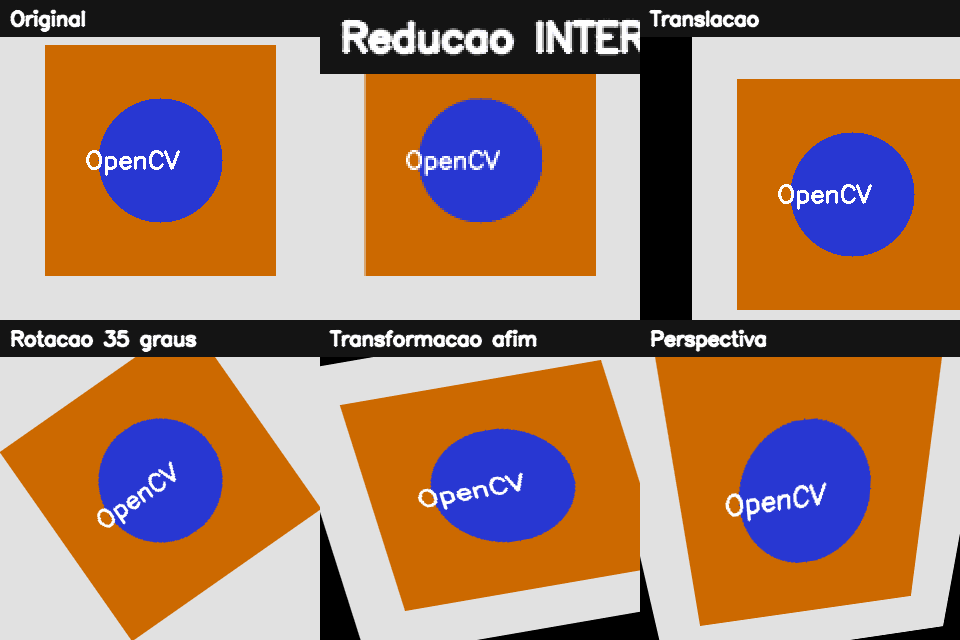

# 2. Transformações geométricas e interpolação

## Duas perguntas diferentes

Uma transformação geométrica responde **onde cada pixel deverá aparecer**. A interpolação responde **qual valor atribuir quando a coordenada calculada não coincide com um pixel existente**. Separar essas perguntas ajuda a escolher o algoritmo corretamente.

## Analogia do mapa em uma folha elástica

Imagine um mapa impresso em uma folha:

- redimensionar estica ou comprime a folha;
- transladar desliza a folha sobre a mesa;
- rotacionar gira em torno de um alfinete;
- transformação afim inclina a folha mantendo linhas paralelas;
- perspectiva permite aproximar um canto e afastar outro, como uma fotografia de documento.

O computador não move matéria. Ele calcula uma relação entre coordenadas de origem e destino.

## Por que usamos mapeamento inverso

No mapeamento direto, cada pixel de origem é lançado no destino. Arredondamentos podem deixar buracos. No **mapeamento inverso**, visitamos cada pixel do destino e perguntamos: “de qual posição contínua da origem devo buscar o valor?”. Assim, toda posição de saída recebe resposta.

Quando a resposta é `(42,3; 17,8)`, não existe um pixel exatamente nessa coordenada. Entra a interpolação:

| Método | Vizinhança | Uso típico |
|---|---:|---|
| `INTER_NEAREST` | 1 | máscaras e rótulos, pois não cria classes novas |
| `INTER_LINEAR` | 2 × 2 | padrão rápido e equilibrado |
| `INTER_CUBIC` | 4 × 4 | ampliação de maior qualidade |
| `INTER_AREA` | áreas | redução com menos aliasing |
| `INTER_LANCZOS4` | 8 × 8 | alta nitidez, maior custo |

!!! important "Máscaras não são fotografias"
    Se os valores `0`, `1` e `2` representam classes, uma interpolação suave pode fabricar `1,4`, que não é uma classe válida. Use vizinho mais próximo para mapas de rótulos.

## Transformações afins

Uma transformação afim utiliza uma matriz `2 × 3`:

\[
\begin{bmatrix}x'\\y'\end{bmatrix}=
\begin{bmatrix}a & b & t_x\\c & d & t_y\end{bmatrix}
\begin{bmatrix}x\\y\\1\end{bmatrix}
\]

Os quatro primeiros coeficientes controlam rotação, escala e cisalhamento; `t_x` e `t_y` controlam o deslocamento. Três pares de pontos não colineares determinam os seis parâmetros.

Para uma rotação, `cv2.getRotationMatrix2D` calcula os termos trigonométricos e também compensa o pivô. Isso explica por que o centro precisa ser informado: girar em torno da origem e girar em torno do centro são operações diferentes.

## Perspectiva e homografia

Uma transformação projetiva usa uma matriz `3 × 3`, definida a partir de quatro pares de pontos. Ela preserva linhas retas, mas não precisa preservar paralelismo. É a ferramenta usada para “desentortar” uma folha fotografada.

Os quatro pontos precisam manter a mesma ordem nos arrays de origem e destino — por exemplo: superior esquerdo, superior direito, inferior esquerdo, inferior direito. Uma troca produz torção ou espelhamento.

## Passo a passo do exemplo

O [código do capítulo 2](https://github.com/vmotta/opera-es-com-imagens/blob/main/exemplos/cap02_transformacoes.py):

1. constrói uma imagem com quinas, círculo e texto para tornar deformações visíveis;
2. amplia com interpolação bicúbica e reduz por área;
3. aplica uma matriz de translação;
4. calcula a rotação em torno do centro;
5. estima uma transformação afim com três pares;
6. estima uma perspectiva com quatro pares;
7. salva cada resultado e um painel comparativo.

```bash
python -m exemplos.cap02_transformacoes
```



## Leitura crítica do resultado

Observe as áreas vazias após translação e rotação. Elas não pertenciam à imagem original, portanto o OpenCV precisa preenchê-las. `borderValue` define a cor constante; outros modos refletem ou replicam a borda. Esse detalhe é relevante antes de uma CNN: bordas artificiais podem se tornar sinais falsos.

## Erros comuns

- passar `(altura, largura)` a `resize` ou `warp`; o parâmetro de tamanho usa `(largura, altura)`;
- usar `INTER_LINEAR` em uma máscara de classes;
- esquecer que rotação pode cortar os cantos se a tela de saída não for ampliada;
- fornecer três pontos quase colineares em uma transformação afim;
- ordenar incorretamente os quatro cantos de um documento.

## Exercícios

1. Duplique o tamanho de uma máscara com `INTER_LINEAR` e `INTER_NEAREST`. Liste os valores únicos das duas saídas.
2. Faça uma rotação de 45° sem cortar os cantos: calcule o novo retângulo envolvente e ajuste a translação da matriz.
3. Fotografe uma folha, marque quatro cantos e gere uma vista superior. Explique como verificaria se a proporção final está correta.
