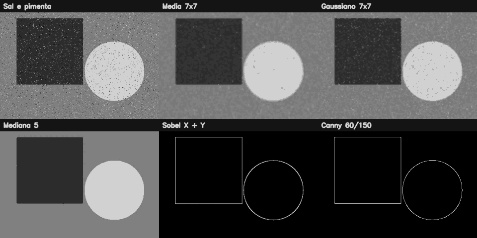

# 3. Filtragem, convolução e detecção de bordas

## O que você aprenderá

Neste capítulo, deixamos de modificar principalmente a posição dos pixels e passamos a recalcular seus valores usando a **vizinhança**. Essa mudança é central: filtros espaciais, suavização, realce, gradientes e detectores de bordas aparecem em praticamente todo pipeline clássico de processamento de imagens.

Ao final, você deverá conseguir:

1. explicar o que é vizinhança de um pixel;
2. compreender o papel de um kernel;
3. interpretar convolução/correlação espacial;
4. criar kernels manualmente;
5. diferenciar média, Gaussiano, mediana e bilateral;
6. relacionar diferentes filtros a diferentes modelos de ruído;
7. compreender por que bordas correspondem a mudanças de intensidade;
8. calcular Sobel X e Sobel Y;
9. entender por que derivadas exigem tipo com sinal;
10. combinar componentes de gradiente;
11. explicar as etapas do detector de Canny;
12. escolher limiares de Canny de modo consciente;
13. reconhecer o efeito do tamanho do kernel;
14. evitar perda de informação por conversão prematura para `uint8`.

A filtragem espacial é uma operação fundamental em processamento digital de imagens (GONZALEZ; WOODS, 2010). Em visão computacional, gradientes e estruturas locais também aparecem como base de métodos de descrição e detecção (SZELISKI, 2022).

---

## 3.1 A ideia central: um pixel passa a “consultar os vizinhos”

Nos capítulos anteriores, muitas operações podiam ser interpretadas como mudanças de posição ou seleção de regiões. Agora, o novo valor de um pixel será calculado a partir dos valores ao seu redor.

### Analogia: votação em um condomínio

Imagine que cada apartamento precisa decidir uma temperatura comum para o corredor. Uma estratégia é pedir a opinião de apartamentos vizinhos. Alguns votos podem valer mais do que outros. O **kernel** define quais vizinhos participam e qual é o peso de cada voto.

---

## 3.2 O que é um kernel?

Um kernel é uma pequena matriz de coeficientes, normalmente de tamanho ímpar, como `3 × 3`, `5 × 5` ou `7 × 7`.

Exemplo de kernel de média `3 × 3`:

\[
K=\frac{1}{9}
\begin{bmatrix}
1&1&1\\
1&1&1\\
1&1&1
\end{bmatrix}
\]

O kernel é deslocado sobre a imagem. Em cada posição, os pixels cobertos são multiplicados pelos pesos correspondentes e os produtos são somados.

De forma simplificada:

\[
G(y,x)=\sum_i\sum_j K(i,j)I(y-i,x-j)
\]

(GONZALEZ; WOODS, 2010).

---

## 3.3 Exemplo numérico pequeno

Considere a vizinhança:

```text
10  10  10
10  250 10
10  10  10
```

Com média `3 × 3`:

```text
soma = 330
média = 330 / 9 ≈ 36,7
```

O valor extremo `250` é espalhado pela vizinhança. Isso explica por que o filtro de média suaviza, mas também pode borrar detalhes.

---

## 3.4 Aplicando um kernel manual com `filter2D`

### Exemplo 1 — média manual

```python
import cv2
import numpy as np

kernel = np.ones((3, 3), dtype=np.float32) / 9.0

suavizada = cv2.filter2D(
    imagem,
    ddepth=-1,
    kernel=kernel
)
```

`ddepth=-1` solicita que a saída preserve o tipo da entrada.

---

## 3.5 Filtro de média

O filtro de média atribui pesos iguais aos vizinhos.

```python
media = cv2.blur(imagem, (5, 5))
```

### Quando ele ajuda?

- ruído leve;
- suavização simples;
- demonstrações didáticas.

### Limitação

Ele não distingue ruído de borda. Assim, mistura pixels dos dois lados de uma fronteira.

### Analogia: misturar tintas próximas

Se você passa um pincel molhado sobre uma divisão entre azul e amarelo, surge uma faixa de mistura. O filtro de média faz algo semelhante numericamente.

---

## 3.6 Filtro Gaussiano

No filtro Gaussiano, os pixels mais próximos do centro recebem pesos maiores.

```python
gauss = cv2.GaussianBlur(
    imagem,
    (5, 5),
    sigmaX=1.2
)
```

Ele é particularmente útil quando o ruído pode ser aproximado por variações distribuídas ao redor do valor verdadeiro (GONZALEZ; WOODS, 2010).

### Analogia: opinião ponderada por proximidade

Em vez de perguntar igualmente para toda a rua, você considera mais a opinião dos vizinhos que moram mais perto.

---

## 3.7 Tamanho do kernel e sigma

Um kernel maior considera uma região espacial maior.

```text
3 × 3  → efeito local pequeno
5 × 5  → suavização maior
11 × 11 → suavização muito mais forte
```

No Gaussiano, `sigma` controla a dispersão dos pesos.

!!! warning "Maior não significa melhor"
    Aumentar o kernel reduz detalhes junto com o ruído. O parâmetro deve ser compatível com o tamanho das estruturas que você deseja preservar.

---

## 3.8 Filtro de mediana

A mediana não calcula uma soma ponderada. Ela ordena os valores e escolhe o valor central.

### Exemplo numérico

```text
10, 11, 9, 10, 255, 12, 10, 11, 9
```

Ordenando:

```text
9, 9, 10, 10, 10, 11, 11, 12, 255
```

A mediana é `10`.

O valor extremo `255` praticamente não influencia o resultado.

```python
mediana = cv2.medianBlur(imagem, 5)
```

### Quando usar?

É especialmente eficaz para ruído impulsivo, como **sal e pimenta**.

---

## 3.9 Ruído sal e pimenta

Esse ruído insere pixels muito claros e muito escuros de forma isolada.

### Exemplo 2 — criando ruído didático

```python
ruidosa = imagem.copy()

rng = np.random.default_rng(42)

quantidade = 2000
ys = rng.integers(0, imagem.shape[0], quantidade)
xs = rng.integers(0, imagem.shape[1], quantidade)

ruidosa[ys[:1000], xs[:1000]] = 255
ruidosa[ys[1000:], xs[1000:]] = 0
```

Agora compare média e mediana.

---

## 3.10 Filtro bilateral

O bilateral considera duas proximidades:

1. distância espacial;
2. diferença de intensidade/cor.

```python
bilateral = cv2.bilateralFilter(
    imagem,
    d=9,
    sigmaColor=75,
    sigmaSpace=75
)
```

Pixels espacialmente próximos, mas muito diferentes em intensidade, influenciam menos uns aos outros. Isso ajuda a preservar bordas.

### Analogia: vizinhos com opiniões parecidas

O filtro considera não apenas quem mora perto, mas também quem possui uma “opinião” de intensidade semelhante.

O custo computacional tende a ser maior que filtros lineares simples.

---

## 3.11 Comparando filtros

| Filtro | Natureza | Boa escolha para | Limitação |
|---|---|---|---|
| média | linear | suavização simples | borra bordas |
| Gaussiano | linear | ruído aproximadamente Gaussiano | ainda mistura fronteiras |
| mediana | não linear | sal e pimenta | custo maior |
| bilateral | não linear | suavizar preservando bordas | mais caro |

---

## 3.12 Realce com kernel

Nem todo kernel suaviza.

Exemplo de realce:

```python
kernel_realce = np.array([
    [0, -1,  0],
    [-1, 5, -1],
    [0, -1,  0]
], dtype=np.float32)

realcada = cv2.filter2D(
    imagem,
    -1,
    kernel_realce
)
```

O peso positivo central preserva/reforça o pixel, enquanto os vizinhos são subtraídos.

---

## 3.13 O que é uma borda?

Uma borda é uma região em que a intensidade muda rapidamente.

Considere uma linha:

```text
20 20 20 20 220 220 220 220
```

Entre `20` e `220` existe uma grande mudança. A derivada será intensa nessa região.

Segundo Gonzalez e Woods (2010), operadores de derivada são ferramentas clássicas para detectar descontinuidades de intensidade.

---

## 3.14 Sobel X e Sobel Y

O Sobel estima derivadas em duas direções.

```python
sobel_x = cv2.Sobel(
    cinza,
    cv2.CV_64F,
    1,
    0,
    ksize=3
)

sobel_y = cv2.Sobel(
    cinza,
    cv2.CV_64F,
    0,
    1,
    ksize=3
)
```

- derivada em `x`: destaca mudanças ao longo do eixo horizontal e, portanto, bordas aproximadamente verticais;
- derivada em `y`: destaca mudanças ao longo do eixo vertical e, portanto, bordas aproximadamente horizontais.

---

## 3.15 Por que não calcular Sobel diretamente em `uint8`?

Uma derivada pode ser negativa.

Exemplo:

```text
20 → 200  = mudança positiva
200 → 20  = mudança negativa
```

`uint8` não representa números negativos.

Por isso:

```python
sobel_x = cv2.Sobel(cinza, cv2.CV_64F, 1, 0)
```

Depois podemos visualizar a magnitude:

```python
sobel_x_vis = cv2.convertScaleAbs(sobel_x)
```

!!! danger "Converter cedo demais perde informação"
    Se você força a derivada negativa para `uint8` antes de tratar seu sinal, pode apagar parte relevante do gradiente.

---

## 3.16 Magnitude do gradiente

Podemos combinar as duas componentes:

\[
|G|=\sqrt{G_x^2+G_y^2}
\]

```python
magnitude = cv2.magnitude(
    sobel_x.astype(np.float32),
    sobel_y.astype(np.float32)
)

magnitude_vis = cv2.convertScaleAbs(magnitude)
```

A direção do gradiente também pode ser calculada com `atan2`.

---

## 3.17 Detector de Canny

O Canny procura bordas finas e conectadas usando uma sequência de etapas (SZELISKI, 2022):

1. suavização para reduzir ruído;
2. cálculo do gradiente;
3. supressão de não máximos;
4. aplicação de dois limiares;
5. histerese para conectar bordas fracas a fortes.

### Analogia: investigar uma estrada

- borda forte: estrada claramente visível;
- borda fraca conectada a uma forte: provavelmente continuação da estrada;
- borda fraca isolada: pode ser ruído.

---

## 3.18 Exemplo de Canny

```python
cinza = cv2.cvtColor(imagem, cv2.COLOR_BGR2GRAY)

suave = cv2.GaussianBlur(
    cinza,
    (5, 5),
    1.2
)

bordas = cv2.Canny(
    suave,
    60,
    150
)
```

Os valores `60` e `150` são limiares didáticos, não números universais.

---

## 3.19 Como os limiares afetam o Canny?

Limiar baixo demais:

- muitas bordas;
- mais ruído;
- contornos fragmentados por detalhes irrelevantes.

Limiar alto demais:

- poucas bordas;
- estruturas fracas desaparecem.

Uma escolha adequada depende do contraste e da aplicação.

---

## 3.20 Efeito das bordas da própria imagem

Quando o kernel chega à borda, parte da vizinhança ficaria fora da imagem. O OpenCV precisa criar valores artificiais usando estratégias como reflexão, repetição ou constante.

Esse detalhe pode alterar resultados perto das extremidades.

### Exemplo 3

```python
filtrada = cv2.GaussianBlur(
    imagem,
    (7, 7),
    1.5,
    borderType=cv2.BORDER_REFLECT
)
```

---

## 3.21 Exemplo integrado do capítulo

O [código completo do capítulo 3](https://github.com/vmotta/opera-es-com-imagens/blob/main/exemplos/cap03_filtros_bordas.py) cria uma cena sintética, adiciona ruído e compara várias estratégias.

```bash
python -m exemplos.cap03_filtros_bordas
```

Pipeline:

```text
imagem limpa
   ↓
ruído sal e pimenta
   ↓
media / Gaussiano / mediana / bilateral
   ↓
Sobel X e Y
   ↓
magnitude
   ↓
Canny
   ↓
painel comparativo
```



---

## 3.22 Erros comuns

| Sintoma | Causa provável | Correção |
|---|---|---|
| imagem excessivamente borrada | kernel grande | reduza tamanho/sigma |
| sal e pimenta continua evidente | filtro inadequado | teste mediana |
| bordas negativas desapareceram | uso prematuro de `uint8` | calcule em `CV_32F`/`CV_64F` |
| Canny detecta tudo | limiares baixos/ruído | suavize e ajuste limiares |
| Canny não detecta quase nada | limiares altos | reduza-os |
| bilateral muito lento | parâmetros grandes | reduza vizinhança ou use outro filtro |
| detalhe fino desaparece | suavização excessiva | ajuste escala do filtro |

---

## 3.23 Perguntas de revisão

1. O que é um kernel?
2. O que significa “deslizar” o kernel sobre a imagem?
3. Por que o filtro de média borra bordas?
4. Por que a mediana lida bem com ruído impulsivo?
5. Qual diferença conceitual existe entre Gaussiano e bilateral?
6. O que uma derivada representa em uma imagem?
7. Por que Sobel X costuma destacar bordas verticais?
8. Por que precisamos de um tipo com sinal?
9. Para que serve a supressão de não máximos do Canny?
10. Qual o papel dos dois limiares?

---

# Exercícios de fixação

## Parte A — kernels

### Exercício 1

Crie manualmente kernels de média `3 × 3`, `5 × 5` e `9 × 9`. Compare o efeito.

### Exercício 2

Crie uma imagem com uma faixa branca em fundo preto e aplique um kernel de realce.

### Exercício 3

Explique por que a soma dos coeficientes de um kernel de média é `1`.

### Exercício 4

Crie um kernel cuja soma seja `0` e aplique-o em uma região de intensidade constante. O que acontece?

## Parte B — ruído

### Exercício 5

Gere ruído sal e pimenta e compare média, Gaussiano e mediana.

### Exercício 6

Gere ruído Gaussiano com NumPy e compare os mesmos filtros. Qual comportamento mudou?

### Exercício 7

Aplique bilateral e Gaussiano a uma imagem com bordas fortes. Compare visualmente a preservação das fronteiras.

## Parte C — gradientes

### Exercício 8

Crie uma imagem com listras verticais e horizontais. Compare Sobel X e Y.

### Exercício 9

Imprima valores mínimos e máximos do Sobel em `CV_64F`. Mostre que existem valores negativos.

### Exercício 10

Calcule a magnitude do gradiente com `cv2.magnitude`.

## Parte D — Canny

### Exercício 11

Execute Canny com três pares de limiares e conte pixels de borda com `np.count_nonzero`.

### Exercício 12

Aplique Canny antes e depois do Gaussiano. Compare a quantidade de componentes desconectados.

### Exercício 13

Construa uma função que receba imagem, tamanho de kernel e limiares e gere automaticamente um painel comparativo.

---

## Síntese

A filtragem espacial transforma um pixel a partir de seu contexto. Kernels de suavização reduzem variações indesejadas; filtros de realce aumentam diferenças; operadores de derivada tornam mudanças visíveis; e o Canny combina várias etapas para produzir bordas mais finas e coerentes. A escolha de parâmetros deve sempre considerar a escala do ruído e a escala das estruturas que precisam ser preservadas.

---

## Referências

BRADSKI, Gary; KAEHLER, Adrian. *Learning OpenCV: Computer Vision with the OpenCV Library*. Sebastopol: O'Reilly Media, 2008.

GONZALEZ, Rafael C.; WOODS, Richard E. *Processamento Digital de Imagens*. 3. ed. São Paulo: Pearson, 2010.

SZELISKI, Richard. *Computer Vision: Algorithms and Applications*. 2. ed. Cham: Springer, 2022.
