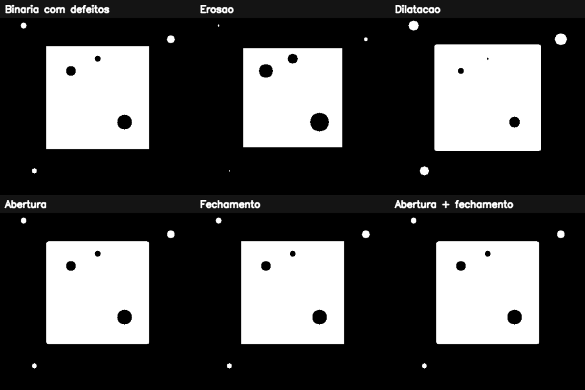

# 4. Limiarização e morfologia matemática

## Da intensidade para uma decisão

Limiarizar é transformar uma medida contínua/discreta de intensidade em uma decisão binária. Para um limiar `T`:

\[
B(y,x)=\begin{cases}255,&I(y,x)>T\\0,&\text{caso contrário}\end{cases}
\]

É semelhante a uma catraca: a altura medida varia continuamente, mas a decisão final é “passa” ou “não passa”. Um limiar fixo funciona quando iluminação e contraste são controlados. Em cenas variáveis, uma única catraca pode tomar decisões ruins.

## Otsu e a forma do histograma

O método de Otsu testa possíveis limiares e escolhe aquele que melhor separa duas classes ao minimizar a variância dentro de cada grupo. Ele funciona bem quando o histograma é aproximadamente bimodal: um grupo para o fundo e outro para o objeto.

Otsu não entende objetos. Se o fundo possui gradiente de iluminação ou há três materiais distintos, a suposição de duas classes pode falhar. Nesses casos, considere limiar adaptativo, correção de iluminação ou um espaço de características diferente.

## Morfologia: um carimbo que percorre a máscara

O elemento estruturante é um pequeno “carimbo”. Sua forma e tamanho definem o que significa vizinhança.

- **erosão:** um pixel branco sobrevive somente quando o carimbo cabe na região branca; encolhe objetos e remove pontos;
- **dilatação:** basta o carimbo tocar uma região branca; expande objetos e preenche pequenas falhas;
- **abertura:** erosão seguida de dilatação; remove objetos brancos pequenos sem manter o encolhimento total;
- **fechamento:** dilatação seguida de erosão; fecha buracos e fendas pretas pequenas;
- **gradiente morfológico:** diferença entre dilatação e erosão; destaca fronteiras.

A abertura é como passar uma peneira que descarta grãos menores que o furo. O fechamento se parece com massa de rejunte que preenche fissuras menores que a ferramenta.

## Passo a passo do exemplo

O [código do capítulo 4](https://github.com/vmotta/opera-es-com-imagens/blob/main/exemplos/cap04_limiar_morfologia.py):

1. cria um objeto com buracos internos e pontos externos;
2. calcula o limiar de Otsu;
3. cria kernel elíptico `9 × 9`;
4. compara erosão, dilatação, abertura e fechamento;
5. combina abertura e fechamento para tratar os dois tipos de defeito.

```bash
python -m exemplos.cap04_limiar_morfologia
```



## A unidade escondida: pixels

Um kernel `9 × 9` expressa tamanho em pixels. Se a câmera mudar de resolução, o mesmo defeito físico ocupará outro número de pixels. Uma solução industrial deve relacionar tamanho de kernel à escala do objeto ou normalizar a imagem antes do processamento.

## Erros comuns

- aplicar morfologia esperando cores, quando a entrada correta deveria ser uma máscara;
- inverter primeiro plano e fundo e obter o efeito oposto;
- usar muitas iterações e apagar detalhes válidos;
- escolher kernel retangular para estruturas curvas sem testar alternativas;
- acreditar que Otsu corrige iluminação irregular.

## Exercícios

1. Teste kernels retangular, elíptico e em cruz. Qual preserva melhor cantos e diagonais?
2. Aumente a resolução da imagem em 2×. Que tamanho de kernel mantém aproximadamente o mesmo efeito físico?
3. Gere uma imagem com sombra gradual e compare Otsu com `adaptiveThreshold`.
