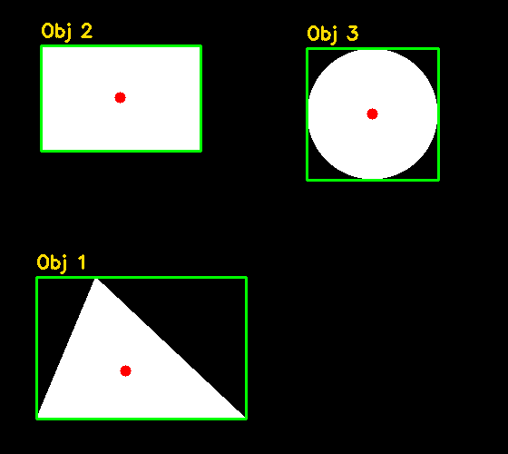

# 5. Contornos e extração de características

## Bordas não são contornos

Uma borda é uma resposta local a mudança de intensidade. Um contorno é uma sequência ordenada de coordenadas que descreve uma fronteira. O Canny pode produzir fragmentos; `findContours` espera uma imagem binária e organiza pixels conectados em estruturas vetoriais.

Essa conversão é uma ponte importante: deixamos de perguntar “qual é o valor deste pixel?” e começamos a perguntar “quantos objetos existem, qual é sua área e onde está seu centro?”.

## O retorno de `findContours`

```python
contornos, hierarquia = cv2.findContours(
    binaria,
    cv2.RETR_EXTERNAL,
    cv2.CHAIN_APPROX_SIMPLE,
)
```

O retorno não é uma imagem. `contornos` é uma lista; cada item contém pontos `(x, y)`. `CHAIN_APPROX_SIMPLE` comprime segmentos retos: um retângulo não precisa guardar todos os pixels de cada lado, apenas pontos suficientes para reconstruir a forma.

## Hierarquia

Um anel possui um contorno externo e um interno. `RETR_EXTERNAL` ignora o buraco e é útil para contar objetos soltos. `RETR_TREE` preserva relações pai-filho. A hierarquia funciona como pastas: um contorno pode conter outro, ter um vizinho ou estar contido.

## Características geométricas

- `contourArea`: área em pixels quadrados;
- `arcLength`: comprimento da fronteira;
- `boundingRect`: caixa alinhada aos eixos;
- `minAreaRect`: retângulo rotacionado de menor área;
- `moments`: somas ponderadas usadas para centroide e orientação;
- `approxPolyDP`: aproximação poligonal.

Com os momentos, o centroide é:

\[
c_x=\frac{m_{10}}{m_{00}}, \qquad c_y=\frac{m_{01}}{m_{00}}
\]

É obrigatório tratar `m00 = 0`, que pode ocorrer em contornos degenerados.

A circularidade fornece uma pista de forma:

\[
C=\frac{4\pi A}{P^2}
\]

Um círculo ideal tende a `1`; formas alongadas têm valores menores. Isso não “reconhece” universalmente um círculo: ruído, escala e resolução afetam área e perímetro.

## Passo a passo do exemplo

O [código do capítulo 5](https://github.com/vmotta/opera-es-com-imagens/blob/main/exemplos/cap05_contornos.py):

1. cria três formas;
2. converte e binariza;
3. extrai somente contornos externos;
4. filtra ruído por área;
5. ordena da esquerda para a direita para produzir IDs estáveis;
6. calcula área, perímetro, caixa, centroide e circularidade;
7. desenha medidas sobre uma cópia da imagem.

```bash
python -m exemplos.cap05_contornos
```



## Por que ordenar

A ordem devolvida por `findContours` não deve ser interpretada como significado semântico. Se um relatório precisa chamar os itens de 1, 2 e 3, defina a regra: posição, área ou outra métrica. Ordenar por `x` transforma um detalhe de implementação em um critério explícito.

## Exercícios

1. Use `RETR_TREE` em uma imagem com anéis e interprete os quatro valores da hierarquia.
2. Classifique triângulo, retângulo e círculo combinando `approxPolyDP` e circularidade.
3. Compare `boundingRect` e `minAreaRect` depois de rotacionar um objeto. Qual caixa estima melhor sua ocupação?
