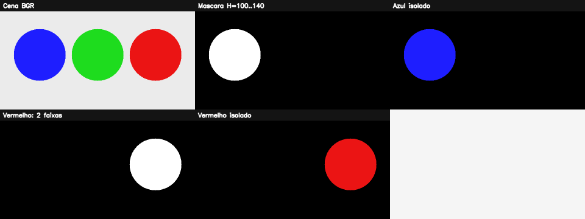

# 6. Espaços de cores e segmentação cromática

## Um espaço de cor é uma forma de organizar a mesma informação

RGB/BGR descreve quanto vermelho, verde e azul compõem o pixel. É excelente para produzir luz em uma tela, mas mistura cor e iluminação: uma superfície azul na sombra possui valores muito diferentes da mesma superfície sob luz forte.

HSV reorganiza a descrição:

- **H — matiz:** posição no círculo de cores;
- **S — saturação:** pureza da cor;
- **V — valor:** brilho.

É como descrever uma tinta por “família da cor”, “quanto está diluída” e “quanto está iluminada”. Essa separação facilita selecionar uma cor tolerando parte da variação de brilho.

## Escala do OpenCV

Em imagens `uint8`, o OpenCV representa H no intervalo `0..179`, enquanto S e V usam `0..255`. H representa meia escala de graus: aproximadamente, verde fica perto de `60`, azul perto de `120` e vermelho perto de `0` **e** `179`.

!!! warning "Vermelho cruza a borda"
    Matiz é circular. Uma faixa vermelha robusta costuma combinar dois intervalos, como `0..10` e `170..179`. Um único intervalo linear pode perder metade dos vermelhos.

## `inRange`: uma caixa no espaço HSV

```python
mascara = cv2.inRange(hsv, limite_inferior, limite_superior)
```

Cada pixel vira branco se H, S e V estiverem simultaneamente dentro dos limites. O resultado é uma máscara binária. Os limites de S e V geralmente excluem tons quase cinza e pixels muito escuros, nos quais a estimativa de matiz é instável.

## Passo a passo do exemplo

O [código do capítulo 6](https://github.com/vmotta/opera-es-com-imagens/blob/main/exemplos/cap06_espacos_cores.py):

1. cria objetos azul, verde e vermelho em BGR;
2. converte toda a cena para HSV;
3. cria uma faixa azul e aplica `inRange`;
4. cria duas faixas vermelhas e as combina com `OR`;
5. aplica cada máscara à imagem original com `bitwise_and`.

```bash
python -m exemplos.cap06_espacos_cores
```



## Como calibrar limites

Não copie limites de uma câmera diferente sem medir. Uma estratégia:

1. capture amostras sob diferentes condições esperadas;
2. selecione pixels do objeto e examine distribuições H, S e V;
3. escolha percentis que cubram variação sem englobar o fundo;
4. aplique morfologia para defeitos pequenos;
5. valide em imagens separadas, inclusive casos difíceis.

HSV melhora a separação, mas não cria invariância completa. Balanço de branco, reflexos especulares e LEDs coloridos podem deslocar a matiz. Quando objeto e fundo têm cores semelhantes, adicione forma, textura ou um modelo aprendido.

## Exercícios

1. Construa controles deslizantes locais para H, S e V e registre os valores para três iluminações.
2. Segmente laranja e use contornos para obter o centro do maior objeto.
3. Compare HSV e Lab em uma cena com sombra. Descreva qual componente separa melhor luminosidade.
