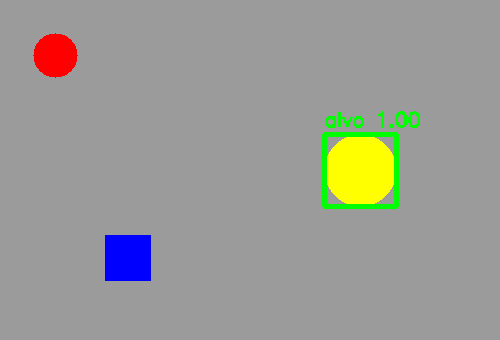

# 7. Template Matching e Haar Cascades

## Duas noções de “parecido”

Este capítulo compara duas famílias clássicas:

- **Template Matching:** busca uma aparência específica, pixel a pixel;
- **Haar Cascade:** busca uma classe aprendida a partir de padrões de contraste.

A primeira é como procurar uma peça usando uma fotocópia em tamanho real. A segunda é como um porteiro treinado para reconhecer uma categoria por uma sequência de perguntas rápidas.

## Template Matching como mapa de similaridade

`cv2.matchTemplate` desliza o template por todas as posições válidas da imagem. Em cada posição calcula uma pontuação. O resultado é uma matriz menor — o **mapa de similaridade**. `minMaxLoc` localiza o melhor pico ou vale, dependendo da métrica.

Com `TM_CCOEFF_NORMED`, valores próximos de `1` indicam forte correlação. Um limiar transforma a pontuação em decisão. Não interprete `0,8` como “80% de probabilidade”: é uma medida de correlação normalizada, não uma probabilidade calibrada.

### Limitações estruturais

O template tem tamanho e orientação fixos. Se o objeto aumentar, girar, deformar ou mudar de iluminação, a correspondência degrada. Podemos criar uma pirâmide de escalas e templates rotacionados, mas o custo cresce rapidamente.

## Viola–Jones e cascatas Haar

Características Haar calculam diferenças entre somas de regiões claras e escuras. Imagens integrais permitem obter essas somas muito rapidamente. Durante o treinamento, AdaBoost seleciona características úteis e as organiza em cascata.

A cascata economiza trabalho: estágios iniciais baratos eliminam a maioria das janelas; somente candidatas plausíveis chegam aos testes mais exigentes. É um processo de triagem, não uma única comparação.

Parâmetros de `detectMultiScale`:

- `scaleFactor`: quanto a janela muda entre escalas; valor próximo de `1` é mais minucioso e lento;
- `minNeighbors`: quantas detecções vizinhas sustentam a decisão; maior reduz falsos positivos;
- `minSize`: ignora objetos menores que a resolução útil.

## Passo a passo do exemplo

O [código do capítulo 7](https://github.com/vmotta/opera-es-com-imagens/blob/main/exemplos/cap07_template_haar.py):

1. cria uma cena geométrica e um template do alvo;
2. calcula o mapa `TM_CCOEFF_NORMED`;
3. localiza o máximo e desenha a caixa se superar `0,80`;
4. carrega o Haar frontal distribuído com OpenCV;
5. aplica-o a uma ilustração propositalmente simplificada;
6. registra inclusive o caso de nenhuma detecção.

```bash
python -m exemplos.cap07_template_haar
```



O experimento Haar ensina uma ideia importante: uma figura que “parece rosto” para uma pessoa não necessariamente pertence à distribuição usada para treinar o classificador. Um resultado vazio é evidência sobre o modelo e a entrada, não falha automática do código.

## Escolha consciente

| Situação | Técnica plausível |
|---|---|
| logotipo rígido, mesma escala e câmera | Template Matching |
| rostos frontais, CPU limitada, cenário controlado | Haar Cascade |
| variações grandes de pose, escala e oclusão | detector baseado em rede neural |

## Exercícios

1. Redimensione o alvo da cena em 20%. Meça a queda da correlação.
2. Varra três escalas do template e converta a localização de volta às coordenadas originais.
3. Em fotografias autorizadas, altere `minNeighbors`. Construa uma tabela de falsos positivos e falsos negativos.
