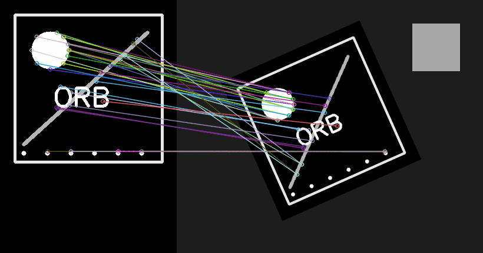
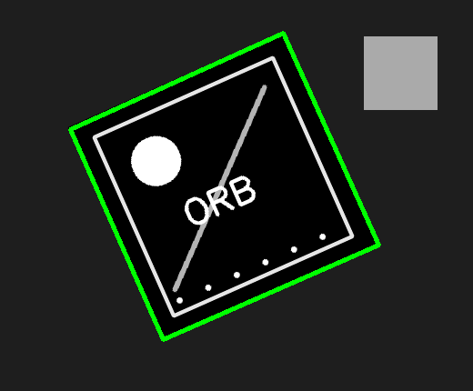

# 8. Características locais e Feature Matching

## Pontos que sobrevivem à mudança

Uma região uniforme é difícil de reencontrar: todos os recortes se parecem. Uma quina, um texto ou uma junção possui variação em múltiplas direções e funciona como marco visual. Detectores localizam esses **keypoints**; descritores transformam a vizinhança em um vetor comparável.

A analogia é um mapa rodoviário: “um trecho de asfalto” não identifica o lugar, mas “o cruzamento ao lado da torre” é distintivo.

## ORB em duas etapas

ORB combina:

1. FAST para localizar cantos em múltiplas escalas;
2. uma orientação estimada para tornar o ponto resistente à rotação;
3. BRIEF rotacionado para gerar um descritor binário.

Como o descritor é uma sequência de bits, a distância natural é **Hamming**: conta quantos bits diferem. Usar distância Euclidiana sem compreender o tipo do descritor mistura geometrias diferentes.

## Correspondência não é prova

O Brute-Force Matcher encontra vizinhos próximos. Regiões repetitivas podem produzir matches convincentes, porém falsos. Duas estratégias ajudam:

- **teste de razão:** aceita o melhor vizinho apenas se ele for claramente melhor que o segundo;
- **cross-check:** exige correspondência recíproca.

Depois, RANSAC estima uma transformação usando subconjuntos e identifica **inliers** coerentes com o mesmo modelo geométrico. É como ouvir várias testemunhas: relatos isolados podem errar, mas um grupo que descreve a mesma transformação aumenta a confiança.

## Homografia e suas condições

Uma homografia relaciona dois planos projetivos. Funciona bem para uma capa de livro, placa ou fachada aproximadamente plana, ou quando a câmera gira sem grande paralaxe. Não descreve perfeitamente objetos 3D com profundidades variadas.

Quatro correspondências são o mínimo algébrico, mas trabalhar com apenas quatro é frágil. Distribua inliers por toda a superfície; pontos concentrados em um canto produzem extrapolação instável.

## Passo a passo do exemplo

O [código do capítulo 8](https://github.com/vmotta/opera-es-com-imagens/blob/main/exemplos/cap08_feature_matching.py):

1. cria uma referência texturizada;
2. gera uma cena rotacionada, reduzida e transladada;
3. detecta até 900 pontos ORB;
4. busca dois vizinhos com distância de Hamming;
5. aplica teste de razão `0,75`;
6. estima homografia com RANSAC;
7. projeta os quatro cantos da referência na cena.

```bash
python -m exemplos.cap08_feature_matching
```





## Diagnóstico

- `des is None`: não havia textura suficiente ou o limiar do detector foi exigente;
- muitas linhas cruzadas: matches ambíguos ou métrica errada;
- quadrilátero absurdo: homografia com poucos inliers ou geometria não planar;
- sucesso em uma imagem, falha em outra escala: pirâmide/quantidade de features insuficiente.

## Exercícios

1. Compare teste de razão `0,60`, `0,75` e `0,90`: registre quantidade de matches e inliers.
2. Adicione padrão repetitivo à cena. Explique por que o número de matches pode aumentar enquanto a qualidade cai.
3. Troque ORB por SIFT e use a métrica adequada. Compare tempo, inliers e robustez.
