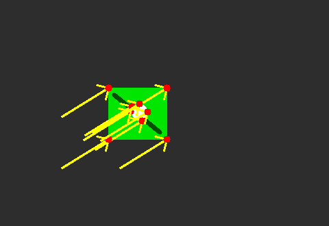

# 9. Vídeo, movimento e fluxo óptico

## O que você aprenderá

Uma imagem isolada registra um instante. Um vídeo acrescenta uma nova dimensão: **tempo**. Neste capítulo, você aprenderá a pensar em sequências de frames, prazo de processamento, movimento aparente e rastreamento de pontos.

Ao final, deverá conseguir:

1. explicar vídeo como sequência temporal de imagens;
2. relacionar FPS e orçamento de tempo por frame;
3. usar `VideoCapture` com segurança;
4. compreender subtração de fundo;
5. interpretar máscaras de movimento;
6. compreender a hipótese de constância de brilho;
7. derivar intuitivamente a equação do fluxo óptico;
8. explicar o problema da abertura;
9. compreender Lucas–Kanade;
10. selecionar bons pontos com Shi–Tomasi;
11. explicar o uso de pirâmides;
12. filtrar pontos por status e erro;
13. calcular deslocamento e velocidade;
14. compreender oclusão, deriva e verificação ida–volta.

O método de Lucas e Kanade (1981) é um dos fundamentos clássicos para estimar movimento local. Szeliski (2022) destaca que análise temporal exige compreender tanto a geometria do movimento quanto as limitações das hipóteses de aparência.

---

## 9.1 Vídeo é uma sequência com memória

Um vídeo pode ser representado como:

```text
frame 0 → frame 1 → frame 2 → ... → frame N
```

Cada frame é uma imagem, mas a informação de movimento surge da relação entre frames.

### Analogia: desenho animado em folhas

Uma folha isolada mostra apenas uma pose. Ao folhear rapidamente várias folhas, percebemos movimento porque comparamos posições ao longo do tempo.

---

## 9.2 FPS e orçamento de tempo

Se o vídeo possui 30 FPS:

\[
\frac{1}{30}\text{ s} \approx 33{,}3\text{ ms}
\]

Isso significa que um sistema que deseja acompanhar a taxa em tempo real precisa, em média, processar cada frame dentro desse orçamento.

Para 60 FPS:

```text
≈ 16,7 ms/frame
```

!!! important "Tempo real não significa apenas 'terminar rápido'"
    Um sistema em tempo real precisa respeitar prazos. Se cada frame demora 100 ms num vídeo de 30 FPS, o atraso tende a se acumular.

---

## 9.3 Abrindo um vídeo ou câmera

```python
cap = cv2.VideoCapture(0)

if not cap.isOpened():
    raise RuntimeError("Não foi possível abrir a câmera")
```

Para arquivo:

```python
cap = cv2.VideoCapture("video.mp4")
```

---

## 9.4 Lendo frames

```python
while True:
    ok, frame = cap.read()

    if not ok:
        break

    # processamento

cap.release()
```

O booleano `ok` deve ser verificado antes de usar `frame`.

---

## 9.5 Consultando propriedades

```python
fps = cap.get(cv2.CAP_PROP_FPS)
largura = int(cap.get(cv2.CAP_PROP_FRAME_WIDTH))
altura = int(cap.get(cv2.CAP_PROP_FRAME_HEIGHT))
frames = int(cap.get(cv2.CAP_PROP_FRAME_COUNT))
```

Nem toda câmera fornece todas as propriedades de maneira confiável; sempre valide os valores retornados.

---

## 9.6 Estratégias para reduzir atraso

Se o processamento é pesado:

- reduza resolução;
- processe frames alternados;
- separe captura e inferência;
- use lote quando o modelo permitir;
- evite conversões desnecessárias;
- meça cada etapa.

### Analogia: esteira industrial

Se chegam 30 peças por segundo e a máquina inspeciona apenas 10, peças se acumulam. É necessário acelerar a inspeção ou reduzir o fluxo processado.

---

## 9.7 Subtração de fundo

Com câmera relativamente estática, podemos modelar o que costuma permanecer no cenário e destacar o que mudou.

```python
subtrator = cv2.createBackgroundSubtractorMOG2(
    history=500,
    varThreshold=16,
    detectShadows=True
)

mascara = subtrator.apply(frame)
```

MOG2 mantém modelos estatísticos adaptativos para os pixels.

---

## 9.8 O subtrator não entende objetos

Movimento detectado pode ser causado por:

- pessoa;
- carro;
- sombra;
- reflexo;
- folhas balançando;
- câmera tremendo;
- mudança de exposição.

Portanto, uma máscara de movimento não é automaticamente uma máscara semântica de “objeto importante”.

---

## 9.9 Limpando máscara de movimento

```python
_, mascara = cv2.threshold(
    mascara,
    200,
    255,
    cv2.THRESH_BINARY
)

kernel = cv2.getStructuringElement(
    cv2.MORPH_ELLIPSE,
    (5, 5)
)

mascara = cv2.morphologyEx(
    mascara,
    cv2.MORPH_OPEN,
    kernel
)

mascara = cv2.morphologyEx(
    mascara,
    cv2.MORPH_CLOSE,
    kernel
)
```

Depois, contornos podem transformar regiões em caixas.

---

## 9.10 Fluxo óptico

Fluxo óptico estima o deslocamento aparente de estruturas entre frames.

Uma hipótese fundamental é a **constância de brilho**:

\[
I(x,y,t)=I(x+u,y+v,t+1)
\]

onde `(u,v)` representa o deslocamento (LUCAS; KANADE, 1981).

### Analogia: acompanhar uma marca numa bola

Se uma pequena marca escura estava em `(x,y)` e aparece poucos pixels adiante no frame seguinte, tentamos estimar esse deslocamento.

---

## 9.11 Linearização da constância de brilho

Para movimentos pequenos, aproximamos:

\[
I_xu+I_yv+I_t=0
\]

Temos:

- `Ix`: mudança espacial em x;
- `Iy`: mudança espacial em y;
- `It`: mudança temporal;
- `u`, `v`: movimento desconhecido.

Há uma equação para duas incógnitas. Precisamos de mais restrições.

---

## 9.12 Lucas–Kanade

Lucas–Kanade assume que, numa pequena vizinhança, os pixels compartilham aproximadamente o mesmo movimento.

Assim, várias equações locais são combinadas para estimar `(u,v)`.

### Analogia: grupo caminhando junto

Uma pessoa isolada pode não fornecer informação suficiente sobre direção. Se vários pontos próximos do mesmo objeto se deslocam de modo coerente, podemos estimar melhor o movimento local.

---

## 9.13 Problema da abertura

Considere uma longa borda diagonal vista por uma pequena janela. É fácil detectar movimento perpendicular à borda, mas difícil determinar quanto ela se move ao longo de sua própria direção.

Esse é o **problema da abertura**.

Quinas são melhores porque possuem variação em mais de uma direção (SZELISKI, 2022).

---

## 9.14 Selecionando bons pontos com Shi–Tomasi

```python
pontos = cv2.goodFeaturesToTrack(
    cinza_anterior,
    maxCorners=200,
    qualityLevel=0.01,
    minDistance=10,
    blockSize=7
)
```

A função privilegia estruturas locais apropriadas ao rastreamento.

---

## 9.15 Lucas–Kanade piramidal no OpenCV

```python
novos, status, erro = cv2.calcOpticalFlowPyrLK(
    cinza_anterior,
    cinza_atual,
    pontos,
    None,
    winSize=(21, 21),
    maxLevel=3
)
```

`status` indica quais pontos foram rastreados com sucesso segundo o algoritmo.

---

## 9.16 Por que usar pirâmides?

Movimentos grandes quebram a hipótese de deslocamento pequeno.

Uma pirâmide cria versões reduzidas da imagem.

### Analogia: mapa em diferentes escalas

Uma viagem de 100 km parece enorme num mapa de bairro, mas pequena num mapa do país. Em resolução reduzida, deslocamentos grandes tornam-se menores e mais fáceis de estimar.

Depois, a estimativa é refinada nas escalas maiores.

---

## 9.17 Filtrando pontos válidos

```python
bons_novos = novos[status.ravel() == 1]
bons_antigos = pontos[status.ravel() == 1]
```

Também podemos filtrar pelo erro:

```python
limite = 15
mascara = (status.ravel() == 1) & (erro.ravel() < limite)
```

Não aceite todos os pontos cegamente.

---

## 9.18 Desenhando vetores

```python
for novo, antigo in zip(bons_novos, bons_antigos):
    x2, y2 = novo.ravel()
    x1, y1 = antigo.ravel()

    cv2.arrowedLine(
        saida,
        (int(x1), int(y1)),
        (int(x2), int(y2)),
        (0, 255, 0),
        2
    )
```

O vetor é:

```python
dx = x2 - x1
dy = y2 - y1
```

---

## 9.19 Deslocamento robusto

Se vários pontos pertencem ao mesmo objeto, podemos calcular a mediana dos deslocamentos:

```python
deslocamentos = bons_novos - bons_antigos

mediana = np.median(
    deslocamentos.reshape(-1, 2),
    axis=0
)

print("dx, dy:", mediana)
```

A mediana reduz a influência de alguns outliers.

---

## 9.20 De pixels por frame para pixels por segundo

Se um objeto se move `4 pixels/frame` em vídeo de 30 FPS:

\[
4 \times 30 = 120\text{ pixels/s}
\]

```python
velocidade_px_s = deslocamento_px_frame * fps
```

Converter para m/s exige calibração geométrica e consideração de perspectiva.

---

## 9.21 Oclusão

Um ponto pode desaparecer atrás de outro objeto ou sair do quadro.

O algoritmo pode:

- perder o ponto;
- associá-lo incorretamente;
- produzir erro alto.

Por isso, rastreamento real exige manutenção de pontos e detecção periódica de novos candidatos.

---

## 9.22 Verificação ida–volta

Uma técnica útil:

1. rastreie `t → t+1`;
2. rastreie o resultado `t+1 → t`;
3. compare a posição de retorno com a original.

Se a distância for grande, a correspondência é suspeita.

```python
erro_fb = np.linalg.norm(
    pontos_retorno - pontos_originais,
    axis=2
)
```

---

## 9.23 Deriva

Pequenos erros acumulados frame a frame podem deslocar gradualmente o rastreador.

### Analogia: caminhada com bússola ligeiramente errada

Um erro de 1° parece pequeno a cada passo, mas após longa distância pode levar a um destino muito diferente.

Re-detectar features periodicamente reduz esse problema.

---

## 9.24 Fluxo esparso e fluxo denso

Lucas–Kanade costuma ser usado como fluxo **esparso**: acompanha pontos selecionados.

Fluxo denso tenta estimar deslocamento para muitas ou todas as posições da imagem.

Esparso:

- menor custo;
- ideal para tracking de features.

Denso:

- fornece campo mais completo;
- maior custo.

---

## 9.25 Exemplo integrado do capítulo

O [código do capítulo 9](https://github.com/vmotta/opera-es-com-imagens/blob/main/exemplos/cap09_fluxo_optico.py) gera dois frames sintéticos com deslocamento conhecido e mede o movimento.

```bash
python -m exemplos.cap09_fluxo_optico
```

Pipeline:

```text
frame anterior
   ↓
frame atual deslocado
   ↓
conversão para cinza
   ↓
Shi–Tomasi
   ↓
Lucas–Kanade piramidal
   ↓
filtro status/erro
   ↓
vetores
   ↓
mediana do deslocamento
   ↓
comparação com deslocamento verdadeiro
```



---

## 9.26 Erros comuns

| Sintoma | Causa provável | Correção |
|---|---|---|
| vídeo não abre | caminho/câmera inválida | teste `isOpened()` |
| `frame` é `None` | fim/erro de captura | verifique retorno |
| atraso cresce | processamento > orçamento | reduza custo/resolução |
| muitos pontos perdidos | movimento grande | aumente pirâmide/janela |
| tracking ruim em parede lisa | pouca textura | selecione quinas |
| pontos saltam entre objetos | ambiguidades/oclusão | ida–volta/filtragem |
| velocidade física absurda | conversão sem calibração | use geometria da câmera |

---

## 9.27 Perguntas de revisão

1. Quanto tempo existe por frame a 30 FPS?
2. Por que uma máscara de MOG2 não é uma máscara semântica?
3. O que significa constância de brilho?
4. Por que há duas incógnitas na equação do fluxo?
5. Qual hipótese Lucas–Kanade adiciona?
6. O que é problema da abertura?
7. Por que quinas são boas para tracking?
8. Para que servem pirâmides?
9. O que `status` representa?
10. O que é deriva?

---

# Exercícios de fixação

### Exercício 1

Calcule o orçamento por frame para 24, 30, 60 e 120 FPS.

### Exercício 2

Abra um vídeo e imprima FPS, largura, altura e número de frames.

### Exercício 3

Meça o tempo médio de uma operação por frame com `time.perf_counter()`.

### Exercício 4

Use MOG2 em um vídeo com câmera parada e aplique morfologia à máscara.

### Exercício 5

Conte objetos móveis por contornos, usando um filtro mínimo de área.

### Exercício 6

Gere dois frames com deslocamento conhecido de `(20, -10)` e estime com Lucas–Kanade.

### Exercício 7

Aumente o deslocamento progressivamente e encontre o ponto de falha.

### Exercício 8

Compare `maxLevel=0`, `1`, `2` e `3`.

### Exercício 9

Implemente verificação ida–volta.

### Exercício 10

Adicione umclusão sintética a parte dos pontos e observe `status`/erro.

### Exercício 11

Calcule deslocamento mediano e médio. Adicione um outlier e compare robustez.

### Exercício 12

Converta 5 pixels/frame para pixels/s em vídeos de 25 e 60 FPS.

### Exercício 13

Explique quais dados adicionais seriam necessários para converter pixels/s em km/h de um veículo real.

---

## Síntese

Vídeo acrescenta tempo ao problema visual. Subtração de fundo detecta mudança; fluxo óptico estima deslocamento aparente; Lucas–Kanade combina gradientes locais; pirâmides ajudam com movimentos maiores; e verificações temporais combatem correspondências ruins. A engenharia de vídeo também exige medir latência e respeitar o orçamento temporal da aplicação.

---

## Referências

LUCAS, Bruce D.; KANADE, Takeo. An iterative image registration technique with an application to stereo vision. In: *Proceedings of Imaging Understanding Workshop*. 1981.

SZELISKI, Richard. *Computer Vision: Algorithms and Applications*. 2. ed. Cham: Springer, 2022.
