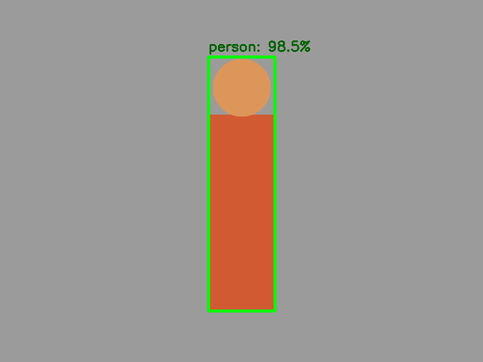

# 10. CNNs e o módulo DNN do OpenCV

## Do filtro escolhido ao filtro aprendido

No Sobel, uma pessoa definiu os pesos. Em uma CNN, o treinamento ajusta centenas ou milhões de kernels para reduzir uma função de erro. As primeiras camadas frequentemente respondem a bordas; camadas intermediárias combinam-nas em texturas e partes; camadas profundas produzem representações úteis para a tarefa.

O OpenCV DNN é principalmente um motor de **inferência**: carrega uma arquitetura e pesos treinados em outro framework, prepara a entrada, executa o *forward pass* e devolve tensores.

## O blob: contrato de entrada

Uma rede não aceita “qualquer imagem”. Ela possui contrato:

- tamanho espacial esperado;
- ordem de canais RGB ou BGR;
- escala numérica (`0..1`, `-1..1`, etc.);
- média e desvio usados no treinamento;
- layout do tensor.

`blobFromImage` normalmente produz NCHW: lote, canais, altura, largura. Uma imagem OpenCV começa HWC. Preparar o blob é como adaptar uma tomada: mesmo com energia correta, pinos no formato errado impedem funcionamento.

!!! danger "Pré-processamento incompatível"
    O modelo pode executar sem erro e ainda produzir previsões ruins se `swapRB`, média, escala ou tamanho estiverem incorretos. Consulte a documentação do modelo; não copie parâmetros de outra rede.

## Interpretando uma saída SSD

Detectores SSD clássicos frequentemente devolvem registros contendo:

`[id_da_imagem, id_da_classe, confiança, x_min, y_min, x_max, y_max]`

As coordenadas podem estar normalizadas em `0..1`. Para desenhar, multiplicamos `x` pela largura e `y` pela altura. Depois filtramos confiança e limitamos coordenadas aos limites da imagem.

Confiança não é necessariamente probabilidade calibrada. Um limiar adequado depende do custo de falso positivo e falso negativo, da classe e do domínio.

## Passo a passo do exemplo

O [código do capítulo 10](https://github.com/vmotta/opera-es-com-imagens/blob/main/exemplos/cap10_dnn_pipeline.py) mantém a execução autocontida:

1. cria uma imagem de entrada;
2. monta blob `1 × 3 × 300 × 300` com escala e média de MobileNet-SSD;
3. mostra forma e intervalo numérico;
4. constrói uma saída SSD simulada com estrutura realista;
5. converte coordenadas normalizadas;
6. filtra e desenha classe, confiança e caixa.

```bash
python -m exemplos.cap10_dnn_pipeline
```



## Da simulação para um modelo real

Para MobileNet-SSD/Caffe, confirme a licença e obtenha o `prototxt` e o `caffemodel` correspondentes. Então:

```python
net = cv2.dnn.readNetFromCaffe(prototxt, pesos)
net.setInput(blob)
deteccoes = net.forward()
```

Não versionamos pesos no repositório: são grandes e possuem origem/licença própria.

## Exercícios

1. Remova a subtração da média e compare o intervalo do blob.
2. Crie função que limite `x1,y1,x2,y2` à imagem e rejeite caixas com área nula.
3. Meça tempo de `forward` após um aquecimento e calcule FPS, separando pré-processamento e inferência.
