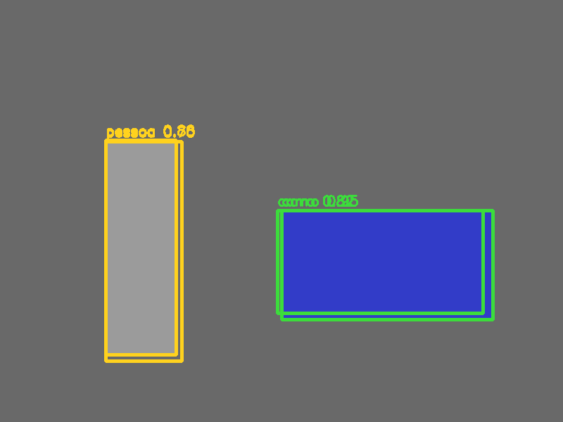
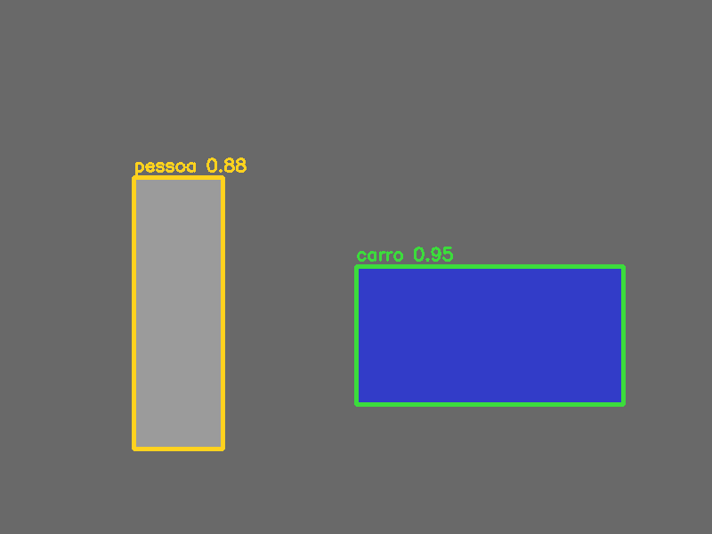

# 11. YOLO, caixas, IoU e NMS

## Detecção em uma passagem

Detectores de duas etapas primeiro propõem regiões e depois as classificam. YOLO reformulou o problema para prever localização e classe em uma única passagem densa. A vantagem central é compartilhar computação sobre a imagem inteira.

Versões modernas diferem bastante das primeiras em cabeças, âncoras, perdas e atribuição de alvos, mas a ideia didática permanece: a rede devolve muitas hipóteses, e precisamos convertê-las em caixas úteis.

## Da forma centro para cantos

Uma predição pode usar centro e tamanho relativos:

\[
x_{min}=c_x-\frac{w}{2},\qquad y_{min}=c_y-\frac{h}{2}
\]

Depois multiplicamos pelos tamanhos da imagem. Sempre verifique qual espaço o modelo usa: imagem original, entrada redimensionada ou *letterbox* com bordas. Ignorar a transformação inversa desloca as caixas.

## IoU: quanto duas caixas compartilham

\[
IoU(A,B)=\frac{|A\cap B|}{|A\cup B|}
\]

IoU `0` significa sem sobreposição; `1` significa caixas idênticas. Ele mede geometria, não classe nem confiança.

## NMS: seleção competitiva

A supressão não máxima:

1. ordena caixas por confiança;
2. mantém a melhor;
3. remove caixas da **mesma classe** com IoU acima do limiar;
4. repete com as restantes.

É como escolher um representante por agrupamento: a caixa mais forte permanece e duplicatas próximas saem. Um limiar muito baixo pode apagar objetos vizinhos; alto demais mantém duplicatas.

!!! important "NMS por classe"
    Uma caixa de “pessoa” não deve apagar uma caixa de “bicicleta” apenas porque se sobrepõem. O exemplo separa classes antes de chamar `NMSBoxes`.

## Passo a passo do exemplo

O [código do capítulo 11](https://github.com/vmotta/opera-es-com-imagens/blob/main/exemplos/cap11_yolo_nms.py):

1. cria pessoa e carro sintéticos;
2. simula duas caixas para cada objeto;
3. converte centro relativo para `(x,y,w,h)` absoluto;
4. desenha todas as hipóteses;
5. agrupa por classe e executa NMS;
6. desenha somente sobreviventes.

```bash
python -m exemplos.cap11_yolo_nms
```

| Antes | Depois |
|---|---|
|  |  |

## Além do NMS clássico

Soft-NMS reduz pontuações em vez de apagar abruptamente. Weighted Boxes Fusion combina coordenadas. Detectores recentes podem usar estratégias próprias. Escolha baseada em métrica e cenário, especialmente quando objetos ficam aglomerados.

## Exercícios

1. Varie `nms_threshold` de `0,1` a `0,9`; explique cada saída.
2. Implemente IoU e compare com caixas que apenas encostam pelas bordas.
3. Simule duas pessoas parcialmente sobrepostas. Mostre por que NMS excessivo pode eliminar uma detecção verdadeira.
