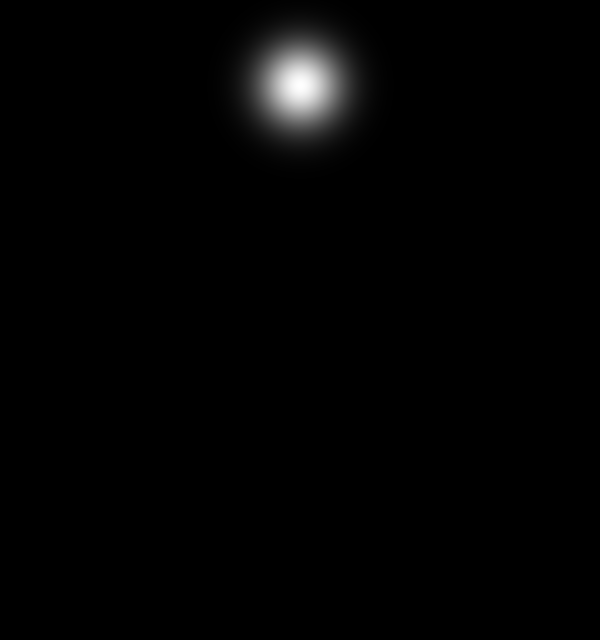
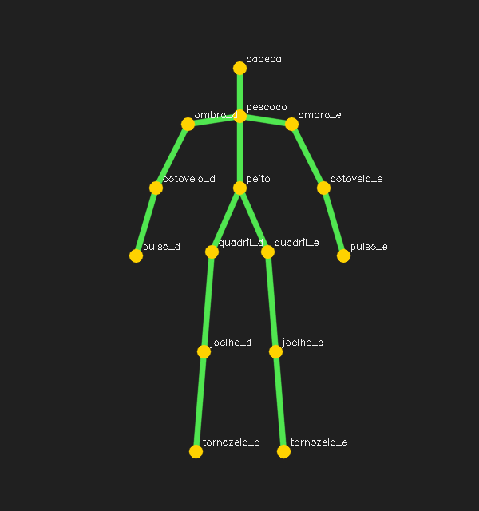

# 12. Estimativa de pose humana

## De uma caixa para uma estrutura articulada

Um detector informa “há uma pessoa nesta região”. A pose estima articulações — cabeça, ombros, cotovelos, pulsos, quadris, joelhos e tornozelos — e conecta pares segundo um modelo do corpo.

A saída não é uma medição médica automática. Keypoints podem estar ausentes, trocados ou deslocados por oclusão, roupas e ângulo. Aplicações esportivas ou de saúde exigem validação específica, calibração e supervisão profissional.

## Top-down e bottom-up

| Abordagem | Fluxo | Comportamento |
|---|---|---|
| top-down | detecta pessoas, depois estima pose em cada caixa | boa precisão individual; custo cresce com pessoas |
| bottom-up | detecta partes na imagem inteira, depois agrupa | compartilha computação; associação é complexa |

OpenPose popularizou uma solução bottom-up com **heatmaps** e **Part Affinity Fields**.

## Heatmap: localização como distribuição

Em vez de devolver uma coordenada dura, a rede produz um mapa por articulação. Regiões claras representam maior confiança. O máximo fornece uma posição candidata, mas preservar a distribuição permite representar incerteza.

Redimensionar o heatmap para o frame exige escala correta. Se a saída mede `46 × 46` e a entrada `368 × 368`, a coordenada do máximo deve ser convertida para o espaço da imagem original.

## PAF: direção e pertencimento

Um cotovelo próximo de duas pessoas não pode ser conectado apenas pela distância. PAFs são campos vetoriais que indicam direção provável dos membros. O algoritmo avalia se o segmento entre dois candidatos segue o campo e monta esqueletos coerentes.

Pense em limalhas de ferro mostrando a direção de um campo magnético: não indicam somente “onde”, mas também “para onde”.

## Passo a passo do exemplo

O [código do capítulo 12](https://github.com/vmotta/opera-es-com-imagens/blob/main/exemplos/cap12_pose.py) evita pesos grandes e expõe a geometria:

1. define nomes e pares anatômicos;
2. gera um heatmap Gaussiano por parte;
3. usa `minMaxLoc` para obter máximo e confiança;
4. descarta pontos abaixo do limiar;
5. conecta somente pares cujos dois extremos existem;
6. salva heatmap e esqueleto.

```bash
python -m exemplos.cap12_pose
```

| Heatmap | Esqueleto |
|---|---|
|  |  |

## Medindo ângulos com cautela

Para o ângulo do cotovelo, use vetores ombro–cotovelo e pulso–cotovelo e produto escalar. Mas coordenadas 2D misturam profundidade: um braço apontado para a câmera pode parecer curto. Suavização temporal reduz tremor, mas introduz atraso.

## Exercícios

1. Remova um pulso e confirme que o código não desenha o antebraço inválido.
2. Implemente função de ângulo entre três pontos e teste com uma configuração conhecida.
3. Adicione ruído temporal aos keypoints e compare média móvel e filtro exponencial em estabilidade e atraso.
