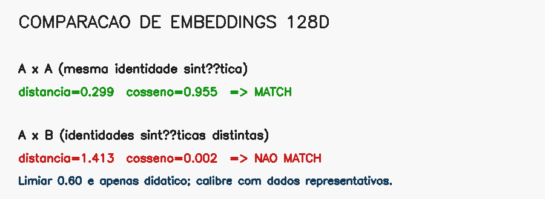

# 13. Reconhecimento facial e embeddings

## Detectar não é reconhecer

Um detector responde **onde há um rosto**. Um reconhecedor recebe um rosto já localizado e responde **quão semelhante sua representação é a outra**. Entre essas etapas ainda existem alinhamento, normalização e controle de qualidade.

Confundir as tarefas produz sistemas frágeis: uma caixa facial não contém identidade; é apenas localização.

## Embedding: endereço em um espaço de características

Uma rede como FaceNet, ArcFace ou SFace transforma o recorte alinhado em um vetor de 128, 512 ou outra dimensão. Vetores da mesma identidade devem ficar próximos e de identidades diferentes, afastados.

Imagine uma biblioteca em que livros semelhantes são colocados em estantes próximas. O embedding não é o nome do livro; é um endereço numérico construído para preservar semelhanças.

Normalização L2 coloca vetores na superfície de uma esfera unitária:

\[
\hat{e}=\frac{e}{\lVert e\rVert_2}
\]

Isso reduz a influência da magnitude e torna comparações mais consistentes.

## Verificação e identificação

- **1:1 — verificação:** compara amostra com uma identidade declarada;
- **1:N — identificação:** busca o vizinho mais próximo em uma base.

Quanto maior `N`, maior a chance de alguma pessoa diferente parecer próxima por acaso. Um limiar usado em 1:1 não deve ser transplantado automaticamente para 1:N.

## Distâncias

Distância Euclidiana:

\[
d(e_1,e_2)=\sqrt{\sum_i(e_{1i}-e_{2i})^2}
\]

Similaridade de cosseno:

\[
s(e_1,e_2)=\frac{e_1\cdot e_2}{\lVert e_1\rVert\lVert e_2\rVert}
\]

Para embeddings normalizados, as duas medidas são relacionadas. O limiar, entretanto, depende do modelo, do pré-processamento, da população e da tolerância a erro.

## Passo a passo do exemplo

O [código do capítulo 13](https://github.com/vmotta/opera-es-com-imagens/blob/main/exemplos/cap13_embeddings_faciais.py) usa vetores sintéticos para estudar a decisão sem dados biométricos:

1. cria um vetor-base de 128 dimensões;
2. gera uma segunda amostra próxima;
3. gera uma identidade independente;
4. normaliza todos os vetores;
5. calcula distância e cosseno;
6. aplica limiar didático e deixa explícito que ele não é calibração real.

```bash
python -m exemplos.cap13_embeddings_faciais
```



## Calibração e responsabilidade

Construa pares genuínos e impostores representativos, meça distribuições e escolha o ponto de operação segundo o custo:

- FAR: taxa de falsos aceites;
- FRR: taxa de falsas rejeições;
- ROC/DET: compromisso ao variar o limiar.

Avalie grupos e condições de captura separadamente. Reconhecimento facial envolve dado biométrico sensível: requer finalidade legítima, minimização, segurança, transparência, retenção limitada e avaliação jurídica/ética aplicável.

## Exercícios

1. Gere 1.000 pares sintéticos genuínos e impostores; trace as distribuições de distância.
2. Calcule FAR e FRR para vários limiares.
3. Explique por que aumentar segurança contra falsos aceites pode aumentar falsas rejeições.
