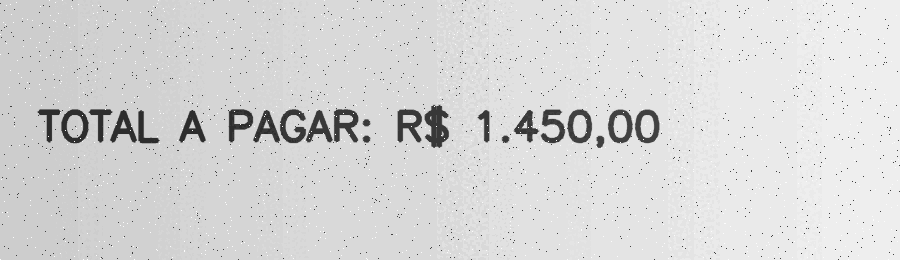
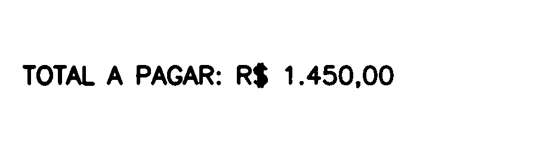

# 14. OCR e extração de texto

## Duas tarefas complementares

OCR em cena costuma reunir:

1. **detecção de texto:** localiza linhas ou palavras;
2. **reconhecimento:** converte o recorte em caracteres.

Tesseract funciona especialmente bem em documentos relativamente alinhados. EAST/CRAFT e reconhecedores neurais são úteis em cenários “in the wild”, mas ainda dependem de escala, orientação e qualidade.

## Pré-processamento como preparação da leitura

Entregar uma foto ruidosa diretamente ao OCR é como pedir para alguém ler uma folha escura, inclinada e amassada. Antes, podemos:

- converter para cinza;
- corrigir iluminação;
- suavizar ruído sem apagar traços;
- binarizar;
- corrigir inclinação (*deskew*);
- aumentar borda e resolução quando necessário.

Não existe pipeline universal. Letras finas podem desaparecer com erosão; blur excessivo une caracteres; inversão errada confunde o motor.

## Otsu e polaridade

Texto escuro em fundo claro costuma ser a configuração mais favorável. O exemplo usa Otsu após Gaussiano e mantém fundo branco. `THRESH_BINARY_INV` seria útil quando etapas morfológicas esperam primeiro plano branco, mas pode ser necessário inverter novamente antes do OCR.

## Modos de segmentação de página

O parâmetro PSM informa a estrutura esperada:

- `6`: bloco uniforme de texto;
- `7`: uma linha;
- `8`: uma palavra;
- `11`: texto esparso.

Escolher PSM é fornecer uma hipótese de layout. Uma placa de uma linha não deve ser tratada como página completa sem motivo.

## Passo a passo do exemplo

O [código do capítulo 14](https://github.com/vmotta/opera-es-com-imagens/blob/main/exemplos/cap14_ocr.py):

1. desenha um recibo sintético;
2. adiciona ruído reprodutível;
3. converte, suaviza e aplica Otsu;
4. salva a imagem pronta mesmo sem Tesseract;
5. verifica executável e biblioteca;
6. escolhe `por` quando disponível e recorre a `eng`;
7. extrai uma string com PSM 6.

```bash
python -m pip install -e ".[ocr]"
python -m exemplos.cap14_ocr
```

| Antes | Pré-processado |
|---|---|
|  |  |

## De texto para dado estruturado

Uma string OCR ainda contém incerteza. Para valores monetários, datas ou códigos:

1. preserve confiança por palavra;
2. normalize espaços e separadores;
3. use expressões regulares como validação, não como prova;
4. compare somas ou dígitos verificadores quando existirem;
5. encaminhe baixa confiança para revisão humana.

## Exercícios

1. Rode PSM 6, 7 e 11 e compare a saída.
2. Rotacione o documento em 8° e implemente deskew.
3. Use `image_to_data` para desenhar caixas e confiança por palavra.
