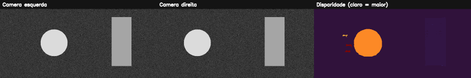

# 15. Visão 3D, geometria epipolar e estéreo

## O que você aprenderá

Neste capítulo, você aprenderá como duas câmeras podem recuperar informação de profundidade a partir da diferença de posição aparente de um mesmo ponto. O objetivo é compreender a geometria antes de simplesmente gerar um mapa colorido.

Ao final, deverá conseguir:

1. explicar por que uma câmera monocular perde profundidade na projeção;
2. compreender baseline e disparidade;
3. relacionar disparidade e profundidade;
4. compreender parâmetros intrínsecos e extrínsecos em alto nível;
5. explicar geometria epipolar;
6. compreender a finalidade da retificação;
7. interpretar busca estéreo como problema de correspondência;
8. compreender limitações em regiões sem textura;
9. configurar parâmetros principais de StereoSGBM;
10. converter a saída fixa para pixels de disparidade;
11. distinguir visualização normalizada de valor métrico;
12. calcular profundidade usando `Z=fB/d`;
13. compreender propagação de erro;
14. reconhecer oclusões e correspondências inválidas.

A visão estéreo é um problema clássico de geometria de múltiplas vistas: duas projeções do mesmo ponto permitem triangulação quando a geometria das câmeras é conhecida (SZELISKI, 2022).

---

## 15.1 O que uma câmera perde?

Uma câmera projeta pontos 3D em uma imagem 2D.

Um ponto:

```text
(X, Y, Z)
```

vira algo como:

```text
(x, y)
```

A coordenada de profundidade não aparece diretamente como um eixo da imagem.

### Analogia: sombra

Uma sombra no chão preserva parte da forma, mas perde informação sobre a distância do objeto ao plano de projeção.

---

## 15.2 Dois olhos fornecem uma nova pista

Feche um olho e observe seu dedo. Depois troque de olho.

O dedo parece mudar de posição em relação ao fundo.

Objetos próximos apresentam deslocamento aparente maior que objetos distantes.

Essa diferença é a base intuitiva da **disparidade**.

---

## 15.3 Baseline

Baseline `B` é a distância entre os centros ópticos das duas câmeras.

```text
câmera esquerda  <---- B ---->  câmera direita
```

Ele precisa ser conhecido em unidade física se quisermos obter profundidade física.

---

## 15.4 Disparidade

Após retificação ideal, um ponto aparece aproximadamente na mesma linha das duas imagens, mas em colunas diferentes.

```text
x_left  = 240
x_right = 200
```

Então:

```text
d = 240 - 200 = 40 pixels
```

Objetos mais próximos tendem a gerar maior disparidade.

---

## 15.5 Relação de profundidade

Para um par estéreo retificado:

\[
Z=\frac{fB}{d}
\]

em que:

- `Z`: profundidade;
- `f`: distância focal em pixels;
- `B`: baseline em metros, centímetros etc.;
- `d`: disparidade em pixels.

As unidades precisam ser coerentes.

---

## 15.6 Exemplo numérico

Suponha:

```text
f = 700 pixels
B = 0,12 m
d = 42 pixels
```

Então:

\[
Z=\frac{700\times0,12}{42}=2\text{ m}
\]

Se a disparidade cair pela metade, a profundidade dobra.

---

## 15.7 Relação inversa

A relação entre `Z` e `d` não é linear.

```text
d grande → objeto próximo
d pequeno → objeto distante
```

Quando `d → 0`, `Z` cresce muito e a estimativa se torna extremamente sensível a pequenos erros.

### Analogia: triangulação com linhas quase paralelas

Quando duas linhas se cruzam com ângulo muito pequeno, uma pequena mudança de direção desloca muito o ponto de encontro.

---

## 15.8 Calibração

Para profundidade métrica, precisamos conhecer a geometria das câmeras.

### Intrínsecos

Relacionados à câmera individual:

- focal;
- centro principal;
- distorção da lente.

### Extrínsecos

Relacionam uma câmera à outra:

- rotação;
- translação.

A calibração estima esses parâmetros a partir de observações de um padrão conhecido.

---

## 15.9 Distorção de lente

Lentes reais podem curvar linhas e deslocar coordenadas.

Antes da correspondência estéreo métrica, normalmente corrigimos distorções com parâmetros de calibração.

Um erro de poucos pixels na correspondência pode ser significativo para profundidades grandes.

---

## 15.10 Geometria epipolar

Dado um ponto numa imagem, seu correspondente na outra não pode aparecer em qualquer lugar: deve pertencer a uma **linha epipolar** determinada pela geometria das câmeras.

Isso reduz o espaço de busca.

### Analogia: procurar numa rua em vez de na cidade inteira

Sem geometria, procuramos o correspondente em toda a imagem. Com a restrição epipolar, procuramos ao longo de uma linha.

---

## 15.11 Retificação

Retificação transforma as duas imagens para que linhas epipolares correspondentes fiquem aproximadamente horizontais.

Depois, a busca por correspondência fica essencialmente:

```text
mesma linha y
procurar em x
```

!!! danger "Mapa bonito não significa profundidade correta"
    Executar StereoSGBM em imagens não retificadas pode produzir números e cores, mas a geometria pode não ter significado métrico confiável.

---

## 15.12 O problema de correspondência

Para cada região da imagem esquerda, precisamos encontrar a região correspondente na direita.

Isso pode ser difícil quando existe:

- parede uniforme;
- padrão repetitivo;
- reflexo;
- transparência;
- oclusão.

---

## 15.13 Por que textura ajuda?

Uma região cheia de detalhes possui assinatura local distinta.

Uma parede branca oferece muitas posições igualmente plausíveis.

### Analogia: montar quebra-cabeça

Uma peça com desenho único é fácil de localizar. Uma peça completamente azul de um céu uniforme pode encaixar em muitos lugares.

---

## 15.14 Oclusão

Alguns pontos são visíveis por uma câmera e escondidos para a outra.

Não existe correspondência verdadeira nesses casos.

Um algoritmo estéreo precisa tolerar/registar regiões inválidas.

---

## 15.15 StereoBM e StereoSGBM

O OpenCV oferece estratégias clássicas de correspondência.

StereoBM:

- block matching mais simples;
- rápido em cenários favoráveis.

StereoSGBM:

- incorpora regularização semiglobal;
- tende a produzir mapas mais suaves/coerentes;
- possui mais parâmetros.

---

## 15.16 Configurando StereoSGBM

```python
sgbm = cv2.StereoSGBM_create(
    minDisparity=0,
    numDisparities=16 * 8,
    blockSize=5,
    uniquenessRatio=10,
    speckleWindowSize=100,
    speckleRange=2
)
```

`numDisparities` deve respeitar as exigências da API e normalmente é múltiplo de 16.

---

## 15.17 `numDisparities`

Define a faixa de disparidades pesquisadas.

Se a disparidade verdadeira estiver fora da faixa, o algoritmo não poderá encontrá-la corretamente.

Faixa maior:

- cobre maior variação de profundidade;
- aumenta custo e ambiguidades possíveis.

---

## 15.18 `blockSize`

Janela maior:

- estabiliza regiões com pouca textura;
- borra limites de profundidade;
- pode misturar objetos próximos e distantes.

Janela menor:

- preserva detalhes;
- pode ser mais sensível a ruído.

---

## 15.19 `uniquenessRatio`

Exige que a melhor correspondência seja suficientemente melhor que alternativas.

A ideia lembra o teste de razão do capítulo de features: correspondências ambíguas devem ser tratadas com cautela.

---

## 15.20 Saída em ponto fixo

Algumas implementações do OpenCV retornam disparidade multiplicada por 16.

```python
disparidade_fixa = sgbm.compute(esquerda, direita)

disparidade = disparidade_fixa.astype(np.float32) / 16.0
```

Use a disparidade em ponto flutuante para cálculos.

---

## 15.21 Máscara de validade

```python
validos = disparidade > 0
```

Em uma configuração real, o critério depende também de `minDisparity` e dos valores inválidos produzidos pelo algoritmo.

Nunca use disparidade zero ou negativa numa divisão sem verificar.

---

## 15.22 Visualização normalizada

Para enxergar o mapa:

```python
visual = cv2.normalize(
    disparidade,
    None,
    0,
    255,
    cv2.NORM_MINMAX
).astype(np.uint8)
```

Essa normalização altera a escala.

!!! important "Imagem 0..255 é apenas visualização"
    Não use `visual` em `Z=fB/d`. O cálculo exige a disparidade original em pixels.

---

## 15.23 Calculando profundidade

```python
profundidade = np.full_like(
    disparidade,
    np.nan,
    dtype=np.float32
)

profundidade[validos] = (
    focal_px * baseline_m /
    disparidade[validos]
)
```

`NaN` é útil para representar regiões sem medida válida.

---

## 15.24 Propagação de erro

Como:

\[
Z=\frac{fB}{d}
\]

uma aproximação da sensibilidade é:

\[
\left|\frac{dZ}{dd}\right|=\frac{fB}{d^2}
\]

Ou seja, o mesmo erro de `1 pixel` causa impacto muito maior quando `d` é pequeno.

---

## 15.25 Exemplo numérico de erro

Com `fB = 84`:

```text
d = 56 → Z = 1,5
d = 55 → Z ≈ 1,527
```

Diferença pequena.

Agora:

```text
d = 8 → Z = 10,5
d = 7 → Z = 12
```

O mesmo erro de 1 pixel produz variação muito maior.

---

## 15.26 Baseline maior sempre é melhor?

Aumentar `B` aumenta disparidade para a mesma profundidade, ajudando a distinguir objetos distantes.

Mas baseline muito grande pode aumentar:

- regiões ocluídas;
- diferenças de aparência;
- dificuldade de correspondência em objetos próximos.

Existe um compromisso de projeto.

---

## 15.27 Exemplo integrado do capítulo

O [código do capítulo 15](https://github.com/vmotta/opera-es-com-imagens/blob/main/exemplos/cap15_visao_estereo.py) cria um par estéreo sintético com disparidades conhecidas.

```bash
python -m exemplos.cap15_visao_estereo
```

Pipeline:

```text
cena texturizada
   ↓
imagem esquerda / direita
   ↓
objetos com deslocamentos diferentes
   ↓
StereoSGBM
   ↓
/16 para pixels
   ↓
máscara de validade
   ↓
visualização normalizada
   ↓
Z=fB/d
   ↓
comparação teórica
```



---

## 15.28 Erros comuns

| Sintoma | Causa provável | Correção |
|---|---|---|
| mapa quase vazio | faixa de disparidade errada | ajuste `numDisparities` |
| bordas de profundidade borradas | `blockSize` grande | reduza e valide |
| parede uniforme com manchas | falta de textura | reconheça ambiguidade |
| profundidade absurda | disparidade normalizada usada | use valor original `/16` |
| divisão infinita | `d≈0` | máscara de validade |
| resultado sem métrica | câmeras não calibradas | calibre/retifique |
| correspondência ruim | imagens não retificadas | aplique mapas de retificação |

---

## 15.29 Perguntas de revisão

1. O que é baseline?
2. O que é disparidade?
3. Qual relação existe entre disparidade e profundidade?
4. Para que serve calibração?
5. O que é geometria epipolar?
6. O que a retificação faz?
7. Por que textura ajuda?
8. Por que `numDisparities` precisa cobrir a faixa correta?
9. Por que dividimos a saída do SGBM por 16 em configurações típicas do OpenCV?
10. Por que profundidade distante é mais sensível ao erro de disparidade?

---

# Exercícios de fixação

### Exercício 1

Calcule `Z` para `f=700 px`, `B=0,12 m` e disparidades 10, 20, 40 e 80.

### Exercício 2

Faça um gráfico de profundidade versus disparidade.

### Exercício 3

Calcule o efeito de erro de 1 pixel para `d=8`, `16`, `32` e `64`.

### Exercício 4

Crie duas imagens sintéticas com um objeto deslocado 32 pixels e verifique a região correspondente.

### Exercício 5

Crie dois objetos com disparidades diferentes e explique qual está mais perto.

### Exercício 6

Remova a textura do fundo e compare o mapa de disparidade.

### Exercício 7

Varie `blockSize` e observe limites entre objetos.

### Exercício 8

Varie `numDisparities` e provoque propositalmente uma faixa insuficiente.

### Exercício 9

Normalize o mapa para visualização e demonstre numericamente que seus valores não são mais a disparidade física original.

### Exercício 10

Crie a matriz de profundidade usando `NaN` para disparidades inválidas.

### Exercício 11

Explique as vantagens e desvantagens de dobrar o baseline.

### Exercício 12

Descreva o pipeline necessário para obter profundidade métrica com duas câmeras reais, desde calibração até triangulação.

### Exercício 13

Explique por que superfícies reflexivas violam a hipótese de aparência semelhante entre as câmeras.

---

## Síntese

Visão estéreo transforma diferença de posição em profundidade, mas apenas quando a geometria está sob controle. Calibração, retificação, correspondência e validação de disparidade são partes inseparáveis do problema. A equação `Z=fB/d` é simples; produzir um `d` confiável é a parte difícil.

---

## Referências

SZELISKI, Richard. *Computer Vision: Algorithms and Applications*. 2. ed. Cham: Springer, 2022.

GONZALEZ, Rafael C.; WOODS, Richard E. *Processamento Digital de Imagens*. 3. ed. São Paulo: Pearson, 2010.
