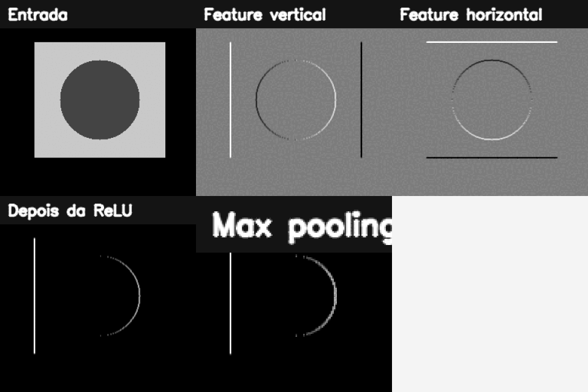

# 16. Construindo Redes Neurais Convolucionais

## O que você aprenderá

Neste capítulo, você deixará de tratar CNN apenas como “caixa pronta de inferência” e estudará como construir uma rede convolucional de classificação. O objetivo é entender dimensões, parâmetros, ativação, pooling, perda, validação e overfitting.

Ao final, deverá conseguir:

1. explicar por que não é ideal achatar uma imagem logo no início;
2. compreender conectividade local e pesos compartilhados;
3. calcular dimensão de saída de uma convolução;
4. compreender filtros e feature maps;
5. calcular número de parâmetros de `Conv2D`;
6. explicar ReLU;
7. compreender pooling e stride;
8. diferenciar `Flatten` e `GlobalAveragePooling`;
9. diferenciar Softmax e Sigmoid;
10. escolher perdas para multiclasse e multirrótulo;
11. compreender treino, validação e teste;
12. reconhecer overfitting;
13. usar augmentation com cautela;
14. compreender dropout, weight decay e early stopping;
15. evitar vazamento de dados.

CNNs exploram estrutura espacial e compartilhamento de pesos para aprender representações hierárquicas com menos parâmetros do que camadas densas aplicadas diretamente aos pixels (GOODFELLOW; BENGIO; COURVILLE, 2016; CHOLLET, 2021).

---

## 16.1 Por que não começar com `Flatten`?

Uma imagem `1000 × 1000 × 3` possui:

```text
3.000.000 valores
```

Se conectarmos diretamente a uma camada densa de 1000 neurônios:

```text
≈ 3 bilhões de pesos
```

Isso ignora explicitamente a estrutura espacial local e cria enorme quantidade de parâmetros.

---

## 16.2 Conectividade local

Uma convolução `3 × 3` observa apenas uma pequena vizinhança por vez.

### Analogia: lupa

Em vez de tentar analisar a fotografia inteira com uma regra diferente para cada posição, usamos uma pequena lupa que percorre a imagem procurando o mesmo padrão.

---

## 16.3 Pesos compartilhados

O mesmo kernel é aplicado em várias posições.

Isso incorpora a hipótese de que uma borda pode ser relevante no canto esquerdo ou direito.

Essa propriedade reduz drasticamente a quantidade de parâmetros.

---

## 16.4 Feature map

Cada filtro produz um mapa de respostas.

Se uma camada possui 32 filtros:

```text
saída possui 32 canais
```

independentemente de a entrada possuir 1 ou 3 canais.

Cada filtro aprende uma forma diferente de responder à entrada.

---

## 16.5 Fórmula da dimensão

Para um eixo com:

- entrada `N`;
- kernel `K`;
- padding `P`;
- stride `S`;

\[
N_{out}=\left\lfloor\frac{N+2P-K}{S}\right\rfloor+1
\]

### Exemplo 1

Entrada `32`, kernel `3`, padding `0`, stride `1`:

\[
(32-3)+1=30
\]

Saída: `30`.

---

## 16.6 Padding `same`

Com kernel ímpar e stride 1, `padding="same"` normalmente preserva altura e largura.

```python
layers.Conv2D(
    32,
    3,
    padding="same",
    activation="relu"
)
```

Isso adiciona valores nas bordas para permitir convolução também nas posições periféricas.

---

## 16.7 Stride

Stride define o passo da janela.

```text
stride 1 → visita posições consecutivas
stride 2 → pula posições, reduzindo resolução
```

Camadas com stride maior podem substituir ou complementar pooling.

---

## 16.8 Quantos parâmetros há numa convolução?

Para:

```text
kernel = 3 × 3
canais entrada = 3
filtros saída = 32
```

cada filtro possui:

```text
3 × 3 × 3 = 27 pesos
```

mais 1 bias.

Total:

\[
(3\times3\times3+1)\times32=896
\]

### Exemplo 2

```python
parametros = (3 * 3 * 3 + 1) * 32
print(parametros)  # 896
```

---

## 16.9 ReLU

\[
ReLU(x)=\max(0,x)
\]

```python
relu = np.maximum(0, feature_map)
```

Ela introduz não linearidade.

### Importante

Valores negativos não são necessariamente “erros”. A função simplesmente define uma transformação que a rede aprende a utilizar.

---

## 16.10 Max Pooling

```python
layers.MaxPooling2D(pool_size=2)
```

Uma janela `2 × 2` com stride 2 reduz aproximadamente pela metade cada dimensão espacial.

### Analogia: resumir um bairro pelo sinal mais forte

Dentro de uma pequena região, preservamos a resposta máxima e descartamos detalhes de posição fina.

---

## 16.11 O que pooling ganha e perde?

Ganha:

- redução de custo;
- maior campo receptivo relativo;
- tolerância a pequenos deslocamentos.

Perde:

- resolução espacial;
- localização precisa.

Por isso, tarefas de segmentação/detecção precisam de arquiteturas que recuperem ou preservem informação espacial.

---

## 16.12 Campo receptivo

O campo receptivo é a região da entrada que pode influenciar uma ativação.

Empilhar convoluções aumenta o campo receptivo.

Duas convoluções `3 × 3` consecutivas enxergam uma região efetiva maior que uma única `3 × 3`, além de introduzir mais não linearidades.

---

## 16.13 `Flatten`

```python
layers.Flatten()
```

transforma mapas:

```text
H × W × C
```

em um vetor.

Pode gerar muitos parâmetros quando seguido por Dense.

---

## 16.14 Global Average Pooling

```python
layers.GlobalAveragePooling2D()
```

calcula uma média por canal, produzindo um vetor de tamanho igual ao número de canais.

Isso frequentemente reduz parâmetros em relação a `Flatten + Dense` grande.

---

## 16.15 Softmax

Para classes mutuamente exclusivas:

```text
gato
cachorro
cavalo
```

podemos usar:

```python
layers.Dense(3, activation="softmax")
```

As saídas formam uma distribuição normalizada entre as classes.

---

## 16.16 Sigmoid para multirrótulo

Se uma imagem pode possuir simultaneamente:

```text
pessoa = sim
bicicleta = sim
capacete = não
```

as classes não competem entre si.

```python
layers.Dense(3, activation="sigmoid")
```

Cada saída é independente.

!!! warning "Softmax e sigmoid respondem a problemas diferentes"
    Escolher a ativação errada altera a própria formulação estatística da tarefa.

---

## 16.17 Função de perda

Multiclasse com rótulo inteiro:

```python
loss="sparse_categorical_crossentropy"
```

Multiclasse com one-hot:

```python
loss="categorical_crossentropy"
```

Multirrótulo:

```python
loss="binary_crossentropy"
```

A perda precisa combinar com a representação do alvo e a saída da rede.

---

## 16.18 Modelo Keras didático

```python
from tensorflow import keras
from tensorflow.keras import layers

modelo = keras.Sequential([
    layers.Input((64, 64, 3)),
    layers.Conv2D(32, 3, padding="same", activation="relu"),
    layers.MaxPooling2D(2),
    layers.Conv2D(64, 3, padding="same", activation="relu"),
    layers.MaxPooling2D(2),
    layers.GlobalAveragePooling2D(),
    layers.Dense(64, activation="relu"),
    layers.Dense(10, activation="softmax"),
])

modelo.summary()
```

---

## 16.19 Calculando dimensões do exemplo

Entrada:

```text
64 × 64 × 3
```

Após Conv `same` 32 filtros:

```text
64 × 64 × 32
```

Após Pool 2:

```text
32 × 32 × 32
```

Após Conv 64:

```text
32 × 32 × 64
```

Após Pool:

```text
16 × 16 × 64
```

Após Global Average Pooling:

```text
64
```

---

## 16.20 Treino, validação e teste

### Treino

Usado para atualizar pesos.

### Validação

Usada para selecionar hiperparâmetros e acompanhar generalização.

### Teste

Deve permanecer separado para avaliação final.

Usar teste repetidamente durante desenvolvimento transforma-o, na prática, em validação.

---

## 16.21 Overfitting

Sintoma típico:

```text
loss treino ↓
acurácia treino ↑
loss validação ↑
acurácia validação para de melhorar
```

A rede está ajustando peculiaridades dos dados de treino que não generalizam.

### Analogia: decorar o gabarito

Um aluno pode memorizar respostas específicas sem aprender o conceito. Vai muito bem nas questões conhecidas e mal nas novas.

---

## 16.22 Data augmentation

Exemplos:

- pequenas rotações;
- translações;
- zoom;
- variação de brilho;
- espelhamento.

Mas a transformação deve preservar o rótulo.

!!! danger "Augmentation precisa respeitar semântica"
    Espelhar um dígito, uma placa, uma imagem médica ou uma orientação anatômica pode mudar o significado.

---

## 16.23 Dropout

Durante treinamento, dropout desativa aleatoriamente parte das ativações.

```python
layers.Dropout(0.3)
```

Ele atua como regularização, mas não é remédio universal.

---

## 16.24 Weight decay

Penalizar pesos muito grandes pode ajudar a controlar complexidade.

Em frameworks modernos, isso pode aparecer como regularização L2 ou variantes desacopladas do otimizador.

A escolha deve ser validada experimentalmente.

---

## 16.25 Early stopping

```python
callback = keras.callbacks.EarlyStopping(
    monitor="val_loss",
    patience=5,
    restore_best_weights=True
)
```

Interrompe o treino quando a validação deixa de melhorar por um período.

---

## 16.26 Vazamento de dados

Se frames do mesmo vídeo aparecem em treino e teste, a rede pode memorizar fundo, iluminação e identidade da sequência.

Da mesma forma, imagens da mesma pessoa ou objeto físico em diferentes splits podem inflar métricas.

Divida dados por unidade independente relevante:

- pessoa;
- paciente;
- vídeo;
- propriedade;
- dispositivo;
- sessão.

---

## 16.27 Métrica adequada

Acurácia pode ser enganosa em classes desbalanceadas.

Considere também:

- precisão;
- revocação;
- F1;
- matriz de confusão;
- métricas por classe.

A métrica precisa refletir o custo do erro.

---

## 16.28 Exemplo integrado do capítulo

O [código do capítulo 16](https://github.com/vmotta/opera-es-com-imagens/blob/main/exemplos/cap16_cnn.py) possui uma parte NumPy/OpenCV autocontida e uma parte Keras opcional.

```bash
python -m exemplos.cap16_cnn

# parte Keras opcional
python -m pip install -e ".[deep]"
```

Pipeline didático:

```text
imagem sintética
  ↓
kernels manuais
  ↓
feature maps
  ↓
ReLU
  ↓
max pooling
  ↓
cálculo de dimensões
  ↓
CNN Keras opcional
  ↓
summary e parâmetros
```



---

## 16.29 Erros comuns

| Sintoma | Causa provável | Correção |
|---|---|---|
| Dense gigantesca | Flatten cedo demais | pooling/GAP |
| shape incompatível | dimensão calculada errada | acompanhe cada camada |
| loss não converge | alvo/loss/ativação incompatíveis | revise formulação |
| treino ótimo, validação ruim | overfitting | regularização/dados |
| teste “bom demais” | vazamento | refaça split |
| augmentation piora | rótulo não preservado | restrinja transformações |
| acurácia alta em classe dominante | desbalanceamento | métricas por classe |

---

## 16.30 Perguntas de revisão

1. Por que CNN usa conectividade local?
2. O que são pesos compartilhados?
3. Como calcular dimensão da convolução?
4. Quantos parâmetros possui Conv `3×3`, entrada 3 canais, saída 32 filtros?
5. Para que serve ReLU?
6. O que pooling perde?
7. Qual diferença entre Flatten e GAP?
8. Quando usar Softmax?
9. Quando usar Sigmoid?
10. O que é vazamento de dados?

---

# Exercícios de fixação

### Exercício 1

Calcule dimensões de saída para entrada 64, kernels 3 e 5, strides 1 e 2.

### Exercício 2

Calcule parâmetros de uma Conv2D `5×5`, 3 canais de entrada e 16 filtros.

### Exercício 3

Calcule parâmetros de uma Conv2D `3×3`, 32 canais de entrada e 64 filtros.

### Exercício 4

Aplique um kernel manual e ReLU a uma imagem simples.

### Exercício 5

Implemente max pooling `2×2` em NumPy para uma matriz pequena.

### Exercício 6

Compare `Flatten` e `GlobalAveragePooling2D` quanto ao tamanho do vetor produzido.

### Exercício 7

Construa uma CNN Keras com duas convoluções e imprima `summary()`.

### Exercício 8

Explique qual saída/perda escolher para 5 espécies mutuamente exclusivas.

### Exercício 9

Explique qual saída/perda escolher para uma imagem que pode conter simultaneamente 5 objetos.

### Exercício 10

Simule curvas de treino/validação com overfitting e indique onde early stopping deveria agir.

### Exercício 11

Proponha cinco augmentations para fotografias de objetos e explique quais preservam o rótulo.

### Exercício 12

Dê um exemplo em que espelhamento muda o rótulo.

### Exercício 13

Planeje um split correto para um dataset com 100 vídeos de 20 pessoas.

### Exercício 14

Explique por que dividir frames aleatoriamente pode causar vazamento.

---

## Síntese

CNNs combinam conectividade local, compartilhamento de pesos e aprendizado hierárquico. Construir uma rede exige acompanhar dimensões e parâmetros, formular corretamente saída e perda e, principalmente, avaliar generalização em dados realmente independentes. Uma arquitetura elegante não compensa um experimento com vazamento ou uma métrica inadequada.

---

## Referências

CHOLLET, François. *Deep Learning with Python*. 2. ed. Shelter Island: Manning, 2021.

GOODFELLOW, Ian; BENGIO, Yoshua; COURVILLE, Aaron. *Deep Learning*. Cambridge: MIT Press, 2016.
