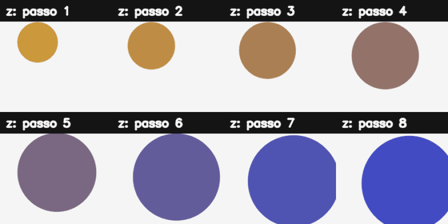

# 17. Redes Adversárias Generativas (GANs)

## O que você aprenderá

Neste capítulo, você aprenderá a compreender GANs como um **jogo de otimização entre duas redes**, e não apenas como uma ferramenta para “criar imagens”. Estudaremos gerador, discriminador, espaço latente, treinamento alternado, instabilidade e avaliação.

Ao final, deverá conseguir:

1. diferenciar modelo discriminativo e generativo;
2. explicar o papel do gerador;
3. explicar o papel do discriminador;
4. interpretar o jogo minimax clássico;
5. compreender espaço latente;
6. gerar interpolações entre vetores latentes;
7. explicar treinamento alternado;
8. compreender por que o discriminador não deve dominar completamente;
9. explicar mode collapse;
10. compreender a ideia de DCGAN;
11. diferenciar convolução transposta de “inversa perfeita”;
12. reconhecer artefatos de upsampling;
13. discutir fidelidade e diversidade;
14. compreender FID em alto nível;
15. discutir riscos e uso responsável de dados e saídas sintéticas.

GANs foram propostas por Goodfellow et al. (2014) como uma estrutura adversarial em que um gerador aprende a produzir amostras e um discriminador aprende a distingui-las dos dados reais.

---

## 17.1 Modelo discriminativo versus generativo

Um classificador tradicional aprende algo como:

```text
imagem → classe
```

Um modelo generativo busca aprender características da distribuição dos dados de modo que possa produzir novas amostras.

### Analogia

Reconhecer pinturas de um artista é diferente de aprender a produzir novas pinturas com características estatisticamente semelhantes ao conjunto observado.

---

## 17.2 As duas redes

### Gerador `G`

Recebe um vetor latente `z`:

```text
z → G(z) → amostra sintética
```

### Discriminador `D`

Recebe uma amostra e produz um escore:

```text
imagem → D(imagem) → escore real/falso
```

---

## 17.3 Analogia do falsificador e do perito

Imagine:

- gerador = falsificador;
- discriminador = perito.

No início, o falsificador produz cópias ruins. O perito as identifica facilmente. A cada rodada, o falsificador recebe informação indireta sobre como melhorar.

A analogia ajuda, mas há uma diferença importante: as redes são funções diferenciáveis treinadas por gradientes.

---

## 17.4 Função minimax clássica

A formulação original é:

\[
\min_G\max_D
\mathbb{E}_{x\sim p_{dados}}[\log D(x)]
+
\mathbb{E}_{z\sim p_z}[\log(1-D(G(z)))]
\]

(GOODFELLOW et al., 2014).

Intuitivamente:

- `D` quer atribuir valor alto a reais e baixo a falsas;
- `G` quer produzir amostras que `D` considere reais.

---

## 17.5 O espaço latente

`z` é normalmente amostrado de uma distribuição simples:

```python
z = np.random.normal(
    size=(batch_size, latent_dim)
)
```

O gerador aprende uma transformação desse espaço para o espaço das imagens.

### Analogia: painel de controles escondido

Imagine um painel com vários controles sem rótulo. À medida que o modelo aprende, diferentes direções no painel podem corresponder a mudanças de aparência, posição, textura ou outras características.

---

## 17.6 Latente não significa automaticamente interpretável

Não podemos assumir que:

```text
z[0] = cor
z[1] = tamanho
z[2] = rotação
```

A representação emerge do treinamento e pode ser altamente distribuída.

Algumas arquiteturas e objetivos buscam maior disentanglement, mas isso não é garantido numa GAN comum.

---

## 17.7 Interpolação no espaço latente

Dados dois vetores:

```python
z1 = rng.normal(size=latent_dim)
z2 = rng.normal(size=latent_dim)
```

podemos interpolar:

```python
for alpha in np.linspace(0, 1, 8):
    z = (1 - alpha) * z1 + alpha * z2
```

Se o espaço aprendido for suave, as amostras podem mudar gradualmente.

---

## 17.8 Exemplo didático sem GAN treinada

Para tornar a ideia visual sem depender de treino pesado, podemos mapear componentes de `z` manualmente para propriedades de uma forma:

```python
x = int(100 + 80 * np.tanh(z[0]))
y = int(100 + 80 * np.tanh(z[1]))
raio = int(20 + 15 * sigmoid(z[2]))
```

Esse exemplo **não é uma GAN**. Ele apenas demonstra que um vetor contínuo pode controlar uma saída visual contínua.

---

## 17.9 Como o discriminador aprende?

Um lote de treino pode conter:

```text
imagens reais → rótulo 1
imagens falsas → rótulo 0
```

O discriminador é atualizado para separar os dois grupos.

Se ele ficar perfeito muito cedo, o gerador pode receber gradientes pouco úteis, dependendo da formulação usada.

---

## 17.10 Como o gerador aprende?

Durante a atualização do gerador:

```text
z
 ↓
G
 ↓
imagem falsa
 ↓
D
 ↓
loss
```

O gradiente atravessa `D` até `G`, mas os pesos do discriminador não são atualizados nessa etapa.

### Analogia

O perito permanece temporariamente fixo enquanto o falsificador tenta melhorar especificamente contra os critérios atuais dele.

---

## 17.11 Treinamento alternado

Ciclo didático:

```text
1. amostrar reais
2. amostrar z
3. gerar falsas
4. treinar D em reais/falsas
5. amostrar novo z
6. congelar atualização de D
7. treinar G através de D
8. repetir
```

O equilíbrio entre as duas redes é um dos desafios centrais.

---

## 17.12 Por que GANs são instáveis?

As duas funções mudam ao mesmo tempo.

É diferente de otimizar uma única loss estacionária: o “adversário” também aprende.

Problemas possíveis:

- gradientes fracos;
- oscilação;
- discriminador dominante;
- gerador dominante temporariamente;
- mode collapse.

---

## 17.13 Mode collapse

O gerador descobre poucas amostras que enganam o discriminador e passa a repetir variações muito semelhantes.

### Analogia: aluno que aprende uma resposta perfeita

Se a prova cobra assuntos variados, responder sempre uma única questão perfeitamente não representa domínio do conteúdo.

Uma GAN deve buscar **qualidade e diversidade**.

---

## 17.14 Fidelidade versus diversidade

### Fidelidade

As amostras individuais parecem plausíveis?

### Diversidade

O gerador cobre diferentes modos do conjunto de dados?

Um modelo pode produzir uma única imagem extremamente convincente e ainda ser um gerador ruim.

---

## 17.15 DCGAN

DCGAN popularizou boas práticas convolucionais para geração de imagens.

Estrutura didática do discriminador:

```text
64×64
 ↓ Conv stride 2
32×32
 ↓ Conv stride 2
16×16
 ↓ ...
 decisão
```

Estrutura do gerador:

```text
vetor z
 ↓ Dense/reshape
8×8×C
 ↓ ConvTranspose/upscale
16×16
 ↓
32×32
 ↓
64×64×3
```

---

## 17.16 Convolução transposta

`Conv2DTranspose` aumenta resolução por uma operação convolucional aprendível.

Ela não é a inversa matemática perfeita de uma convolução comum.

### Exemplo Keras

```python
layers.Conv2DTranspose(
    128,
    4,
    strides=2,
    padding="same"
)
```

---

## 17.17 Artefatos quadriculados

Combinações de kernel e stride em convoluções transpostas podem produzir padrões repetitivos.

Uma alternativa é:

```text
UpSampling2D
     ↓
Conv2D
```

```python
layers.UpSampling2D(size=2)
layers.Conv2D(128, 3, padding="same")
```

Compare visualmente e por métricas.

---

## 17.18 Normalizações e ativações

Arquiteturas GAN usam escolhas cuidadosas de:

- normalização;
- ativação;
- inicialização;
- taxa de aprendizado;
- otimizador.

Essas decisões afetam estabilidade. Não copie uma arquitetura parcialmente sem compreender o conjunto de escolhas de treinamento.

---

## 17.19 Loss do discriminador não é uma métrica de qualidade visual

Uma loss aparentemente “equilibrada” não garante imagens boas.

Da mesma forma:

- D com 50% de acerto não significa necessariamente convergência ideal;
- G com loss baixa não prova diversidade.

Sempre examine amostras e métricas adequadas.

---

## 17.20 FID em alto nível

FID compara estatísticas de features extraídas de conjuntos reais e gerados.

Em termos gerais, quanto menor, mais próximas estão as distribuições nessas representações.

Mas FID depende de:

- quantidade de amostras;
- domínio;
- implementação;
- pré-processamento.

Não compare valores calculados em condições diferentes como se fossem diretamente equivalentes.

---

## 17.21 Avaliação visual também possui viés

Mostrar apenas as melhores 20 imagens de 100 mil gera uma impressão enganosa.

Avaliação deve usar:

- amostras aleatórias;
- quantidade suficiente;
- métricas;
- inspeção de diversidade;
- análise de falhas.

---

## 17.22 Memorização

Um gerador pode reproduzir ou aproximar excessivamente amostras do treinamento.

Isso é particularmente relevante com datasets pequenos ou conteúdo sensível.

Avaliações de similaridade e políticas de dados são importantes em aplicações reais.

---

## 17.23 Uso responsável

Projetos generativos devem considerar:

- origem e licença dos dados;
- consentimento quando aplicável;
- vieses do conjunto;
- risco de reproduzir conteúdo sensível;
- transparência sobre origem sintética;
- possibilidade de uso enganoso.

Uma imagem gerada não deve ser apresentada como registro documental de um evento real.

---

## 17.24 Exemplo integrado do capítulo

O [código do capítulo 17](https://github.com/vmotta/opera-es-com-imagens/blob/main/exemplos/cap17_gan.py) mantém uma parte autocontida para visualizar espaço latente e, opcionalmente, monta arquiteturas Keras.

```bash
python -m exemplos.cap17_gan

# parte profunda opcional
python -m pip install -e ".[deep]"
```

Pipeline:

```text
z1 e z2
 ↓
interpolações
 ↓
função visual didática
 ↓
painel latente
 ↓
gerador Keras opcional
 ↓
discriminador opcional
 ↓
contagem de parâmetros
```



---

## 17.25 Erros comuns

| Sintoma | Causa provável | Correção |
|---|---|---|
| gerador produz quase tudo igual | mode collapse | revisar objetivo/treino/dados |
| discriminador perfeito rapidamente | desequilíbrio | ajustar treinamento |
| artefatos em grade | upsampling transposto | testar resize+conv |
| loss parece boa, imagens ruins | loss não mede qualidade visual | avaliar amostras/métricas |
| FID comparado entre setups diferentes | protocolo inconsistente | padronizar avaliação |
| pouca variedade no dataset | cobertura insuficiente | revisar dados |
| amostras parecem treino | possível memorização | investigar similaridade |

---

## 17.26 Perguntas de revisão

1. Qual diferença existe entre modelo discriminativo e generativo?
2. O que recebe o gerador?
3. O que o discriminador tenta aprender?
4. O que é espaço latente?
5. Por que interpolação é interessante?
6. Como o gradiente chega ao gerador?
7. O que é mode collapse?
8. Qual diferença existe entre fidelidade e diversidade?
9. Conv2DTranspose é uma inversa perfeita?
10. Por que loss isolada não basta para avaliar GAN?

---

# Exercícios de fixação

### Exercício 1

Gere dois vetores latentes de dimensão 8 e produza 10 interpolações lineares.

### Exercício 2

Mapeie dois componentes do vetor para posição `(x,y)` de um círculo e visualize a trajetória.

### Exercício 3

Mapeie outro componente para raio e outro para intensidade de cor.

### Exercício 4

Explique por que esse mapeamento manual não é uma GAN treinada.

### Exercício 5

Desenhe o fluxo de gradiente na atualização do discriminador.

### Exercício 6

Desenhe o fluxo de gradiente na atualização do gerador.

### Exercício 7

Explique o que aconteceria se o discriminador sempre retornasse 1 para reais e 0 para falsas desde o primeiro passo.

### Exercício 8

Crie um exemplo conceitual de mode collapse com três classes visuais.

### Exercício 9

Compare a quantidade de parâmetros de um pequeno gerador e discriminador Keras.

### Exercício 10

Substitua `Conv2DTranspose` por `UpSampling2D + Conv2D` e compare shapes.

### Exercício 11

Construa uma grade aleatória de 64 amostras em vez de selecionar manualmente as melhores.

### Exercício 12

Explique por que qualidade visual alta com diversidade baixa é insuficiente.

### Exercício 13

Escreva um checklist de documentação para um dataset usado em geração de imagens.

---

## Síntese

GANs transformam geração em um jogo de otimização. O gerador tenta aproximar a distribuição dos dados; o discriminador fornece um sinal adversarial; e o espaço latente organiza a fonte de variação. Treinar bem exige equilibrar as duas redes e avaliar tanto fidelidade quanto diversidade. Compreender as falhas é tão importante quanto gerar imagens visualmente impressionantes.

---

## Referências

GOODFELLOW, Ian et al. Generative Adversarial Nets. In: *Advances in Neural Information Processing Systems*. 2014.

GOODFELLOW, Ian; BENGIO, Yoshua; COURVILLE, Aaron. *Deep Learning*. Cambridge: MIT Press, 2016.
