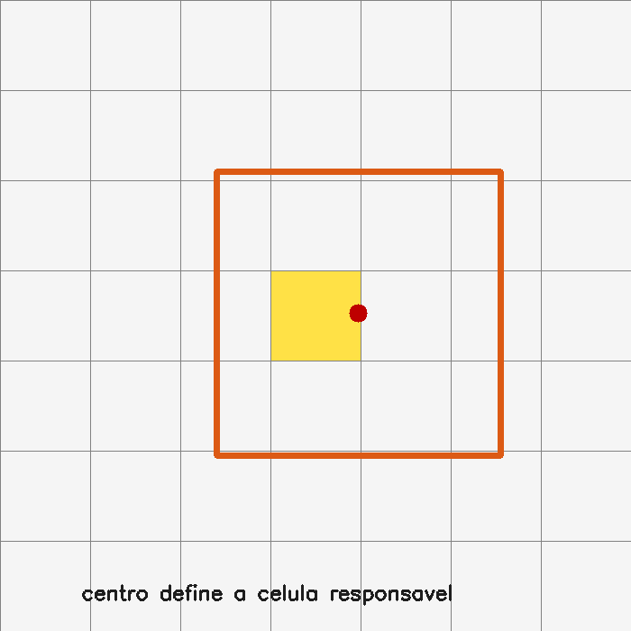

# 18. YOLO moderno e inferência prática

## O que você aprenderá

Neste capítulo final, você integrará vários conceitos anteriores em um pipeline moderno de detecção: preparação da imagem, responsabilidade espacial, múltiplas escalas, coordenadas, *letterbox*, inferência, resultados, métricas e desempenho.

Ao final, deverá conseguir:

1. compreender a ideia histórica de responsabilidade espacial do YOLO;
2. reconhecer que implementações modernas diferem das versões iniciais;
3. explicar por que detectores usam múltiplas escalas;
4. compreender *letterbox*;
5. calcular escala e padding;
6. converter caixas entre espaço original e espaço preparado;
7. interpretar coordenadas `xyxy` e `xywh`;
8. compreender confiança e classe;
9. interpretar objetos `Results` em alto nível;
10. compreender IoU, NMS e avaliação como parte do pipeline;
11. diferenciar precisão e revocação;
12. compreender AP e mAP;
13. diferenciar latência e throughput;
14. planejar benchmarks reproduzíveis;
15. comparar modelos pelo compromisso entre qualidade e custo.

YOLO foi originalmente apresentado como detector unificado de uma etapa (REDMON et al., 2016). A família evoluiu profundamente; por isso, este capítulo separa conceitos duradouros de detalhes específicos de uma versão.

---

## 18.1 O que permanece da ideia YOLO?

A ideia didática central é evitar uma busca independente por milhares de recortes. Uma rede compartilha computação sobre a imagem e produz previsões densas de objetos.

### Analogia: fiscal olhando a praça inteira

Em vez de fotografar cada metro quadrado da praça separadamente e perguntar “há alguém aqui?”, o fiscal observa a cena inteira e aponta posições onde acredita existirem objetos.

---

## 18.2 A explicação clássica da grade

Nas primeiras formulações, uma grade dividia a imagem e a célula que continha o centro do objeto assumia responsabilidade por ele (REDMON et al., 2016).



Essa ideia continua útil para compreender a relação entre mapas de features e posições espaciais.

!!! note "Modelo didático não é descrição literal de toda versão moderna"
    Detectores atuais podem usar atribuição dinâmica, estratégias anchor-free, diferentes cabeças e múltiplas escalas. Sempre consulte a arquitetura específica do modelo utilizado.

---

## 18.3 Centro do objeto e célula responsável

Se uma grade é `7 × 7` e a imagem mede `700 × 700`, cada célula didática mede `100 × 100`.

Um centro em:

```text
(x=350, y=250)
```

pertence aproximadamente à:

```text
coluna 3
linha 2
```

considerando índice iniciado em zero.

### Exemplo 1

```python
coluna = int(cx / largura * grade)
linha = int(cy / altura * grade)
```

---

## 18.4 Objetos pequenos são difíceis

Um objeto pequeno pode ocupar poucos pixels e desaparecer progressivamente em mapas de baixa resolução.

Por isso, detectores modernos combinam representações de diferentes escalas.

---

## 18.5 Cabeças multiescala

Mapas de alta resolução:

- preservam detalhes espaciais;
- ajudam objetos pequenos.

Mapas profundos de menor resolução:

- possuem contexto semântico maior;
- ajudam objetos grandes e padrões complexos.

### Analogia: mapas da cidade

Um mapa de bairro mostra ruas pequenas; um mapa estadual mostra contexto amplo. Um detector combina escalas para enxergar detalhes e contexto.

---

## 18.6 O problema de redimensionar para quadrado

Imagem original:

```text
1280 × 720
```

Entrada do modelo:

```text
640 × 640
```

Se simplesmente fizermos:

```python
cv2.resize(imagem, (640, 640))
```

os objetos serão deformados.

---

## 18.7 Letterbox

*Letterbox* preserva proporção e adiciona padding.

### Passo 1 — escala

```python
escala = min(
    alvo_w / largura,
    alvo_h / altura
)
```

### Passo 2 — tamanho redimensionado

```python
novo_w = round(largura * escala)
novo_h = round(altura * escala)
```

### Passo 3 — padding

```python
pad_x = (alvo_w - novo_w) / 2
pad_y = (alvo_h - novo_h) / 2
```

---

## 18.8 Exemplo numérico de letterbox

Original:

```text
1280 × 720
```

Alvo:

```text
640 × 640
```

Escala:

```text
min(640/1280, 640/720)
= min(0.5, 0.888...)
= 0.5
```

Novo tamanho:

```text
640 × 360
```

Padding vertical total:

```text
640 - 360 = 280
```

aproximadamente `140` pixels acima e `140` abaixo.

---

## 18.9 Implementação didática de letterbox

```python
def letterbox(imagem, alvo=(640, 640)):
    h, w = imagem.shape[:2]
    alvo_w, alvo_h = alvo

    escala = min(alvo_w / w, alvo_h / h)

    novo_w = int(round(w * escala))
    novo_h = int(round(h * escala))

    red = cv2.resize(
        imagem,
        (novo_w, novo_h),
        interpolation=cv2.INTER_LINEAR
    )

    esquerda = (alvo_w - novo_w) // 2
    direita = alvo_w - novo_w - esquerda
    topo = (alvo_h - novo_h) // 2
    baixo = alvo_h - novo_h - topo

    saida = cv2.copyMakeBorder(
        red,
        topo,
        baixo,
        esquerda,
        direita,
        cv2.BORDER_CONSTANT,
        value=(114, 114, 114)
    )

    return saida, escala, esquerda, topo
```

---

## 18.10 Caixas pertencem ao espaço em que foram previstas

Se uma rede prevê uma caixa no espaço letterbox, ela não pode ser desenhada diretamente na imagem original.

Precisamos remover padding e desfazer escala.

---

## 18.11 Invertendo letterbox

Para coordenadas `x`:

\[
x_{orig} = \frac{x_{prep}-pad_x}{escala}
\]

Para `y`:

\[
y_{orig} = \frac{y_{prep}-pad_y}{escala}
\]

### Exemplo 2

```python
def desfazer_letterbox(
    caixa,
    escala,
    pad_x,
    pad_y
):
    x1, y1, x2, y2 = caixa

    x1 = (x1 - pad_x) / escala
    x2 = (x2 - pad_x) / escala
    y1 = (y1 - pad_y) / escala
    y2 = (y2 - pad_y) / escala

    return x1, y1, x2, y2
```

Depois aplique clipping aos limites da imagem.

---

## 18.12 Formatos comuns de caixa

### `xyxy`

```text
x1, y1, x2, y2
```

### `xywh`

```text
centro_x, centro_y, largura, altura
```

ou, em algumas APIs, topo esquerdo + largura/altura.

!!! warning "O nome sozinho pode não ser suficiente"
    Confirme sempre a documentação da biblioteca. Convenções de `xywh` podem variar.

---

## 18.13 Inferência com biblioteca de alto nível

Um exemplo conceitual com Ultralytics pode ser:

```python
from ultralytics import YOLO

modelo = YOLO("yolov8n.pt")
resultados = modelo("imagem.jpg")
```

Versões, nomes de modelos e APIs evoluem. Consulte a documentação correspondente à versão instalada.

---

## 18.14 Objeto de resultados

Bibliotecas de alto nível normalmente agrupam:

- caixas;
- classes;
- confianças;
- imagem original;
- metadados de transformação;
- resultados adicionais conforme a tarefa.

Uma aplicação não deve depender de atributos não documentados sem testes de versão.

---

## 18.15 Transferência GPU → CPU

Tensores podem estar na GPU.

Converter repetidamente:

```text
GPU → CPU → NumPy
```

pode gerar overhead.

Converta apenas quando necessário para integração com código NumPy/OpenCV.

---

## 18.16 Confiança mínima

Limiar baixo:

- mais detecções;
- maior revocação potencial;
- mais falsos positivos.

Limiar alto:

- menos detecções;
- maior seletividade;
- pode perder objetos.

Avalie no seu conjunto, não em uma única fotografia.

---

## 18.17 IoU e NMS continuam relevantes

Mesmo que uma biblioteca encapsule o pós-processamento, os conceitos do capítulo 11 permanecem.

Você precisa compreender:

- quando caixas são consideradas duplicatas;
- se NMS é por classe;
- quais limiares foram usados;
- como resultados mudam ao alterar configuração.

---

## 18.18 Precisão

\[
Precisão=\frac{TP}{TP+FP}
\]

Pergunta:

> “Entre as detecções produzidas, quantas estavam corretas?”

Alta precisão significa poucos falsos positivos entre as previsões.

---

## 18.19 Revocação

\[
Revocação=\frac{TP}{TP+FN}
\]

Pergunta:

> “Entre os objetos reais, quantos foram encontrados?”

Alta revocação significa poucos objetos perdidos.

---

## 18.20 Compromisso precisão–revocação

Reduzir o limiar de confiança tende a aumentar a quantidade de detecções.

Isso pode:

- aumentar revocação;
- reduzir precisão.

A curva precisão–revocação analisa esse compromisso em vários limiares.

---

## 18.21 AP

Average Precision resume o desempenho de uma classe ao longo da curva precisão–revocação sob determinado critério de IoU.

Não interprete AP como “porcentagem simples de acertos”. É uma métrica agregada sobre diferentes limiares de confiança.

---

## 18.22 mAP

Mean Average Precision calcula média das APs entre classes e, conforme o protocolo, entre limiares de IoU.

Ao comparar resultados, informe o protocolo completo.

Exemplos diferentes de mAP podem não ser diretamente comparáveis se usarem critérios diferentes.

---

## 18.23 Latência versus throughput

### Latência

Tempo para processar uma entrada.

```text
ms/imagem
```

### Throughput

Quantidade processada por unidade de tempo.

```text
imagens/s
```

Batch maior pode aumentar throughput e, ao mesmo tempo, aumentar latência individual.

---

## 18.24 FPS não é comparação suficiente

Ao comparar dois detectores, registre:

- hardware;
- CPU/GPU;
- versão da biblioteca;
- precisão numérica;
- tamanho da entrada;
- batch;
- aquecimento;
- pré-processamento incluído ou não;
- pós-processamento incluído ou não.

Sem isso, “120 FPS” tem pouco valor científico.

---

## 18.25 Benchmark reproduzível

```python
import time
import numpy as np

tempos = []

for i in range(30):
    inicio = time.perf_counter()

    # inferência

    duracao = time.perf_counter() - inicio

    if i >= 5:  # descarta aquecimento
        tempos.append(duracao)

print("mediana ms:", np.median(tempos) * 1000)
```

Meça em várias entradas representativas.

---

## 18.26 Modelo maior não é automaticamente melhor

Um modelo maior pode melhorar alguma métrica, mas exigir:

- mais memória;
- maior latência;
- mais energia;
- hardware mais caro.

O melhor modelo é aquele que satisfaz as restrições reais da aplicação.

### Analogia: caminhão e motocicleta

Um caminhão carrega mais, mas não é melhor veículo para toda tarefa. A escolha depende da carga, estrada, velocidade e custo.

---

## 18.27 Objetos pequenos e resolução de entrada

Aumentar a resolução pode tornar objetos pequenos mais visíveis ao detector.

Mas aumenta:

- memória;
- operações;
- latência.

Teste a relação entre ganho de AP/recall e custo.

---

## 18.28 Inferência em vídeo

Em vídeo, também entram questões temporais:

- decodificação;
- fila de frames;
- atraso acumulado;
- batch/streaming;
- tracking entre frames.

Um detector rápido isoladamente pode não garantir pipeline em tempo real se captura e renderização forem gargalos.

---

## 18.29 Exemplo integrado do capítulo

O [código do capítulo 18](https://github.com/vmotta/opera-es-com-imagens/blob/main/exemplos/cap18_yolo_moderno.py) possui uma parte autocontida e uma parte opcional com modelo real.

Execução sem rede:

```bash
python -m exemplos.cap18_yolo_moderno
```

Inferência opcional:

```bash
python -m pip install -e ".[yolo]"
python -m exemplos.cap18_yolo_moderno \
    --imagem caminho/rua.jpg \
    --modelo yolov8n.pt
```

O primeiro uso de alguns modelos pode depender de pesos externos. Verifique origem, licença e políticas de rede do ambiente.

Pipeline didático:

```text
imagem
  ↓
grade/centro didático
  ↓
letterbox
  ↓
escala + padding
  ↓
caixa em espaço preparado
  ↓
transformação inversa
  ↓
IoU
  ↓
inferência opcional
  ↓
resultados
  ↓
benchmark
```

---

## 18.30 Erros comuns

| Sintoma | Causa provável | Correção |
|---|---|---|
| caixas deslocadas | padding não removido | reverta letterbox |
| objetos achatados | resize direto | preserve proporção |
| `xywh` interpretado errado | convenção diferente | consulte API |
| benchmark inconsistente | sem aquecimento/protocolo | padronize medição |
| FPS alto e resultado ruim | resolução/modelo pequeno | avalie qualidade + custo |
| mAP comparado incorretamente | protocolos diferentes | informe IoU/classes/dataset |
| memória alta | resolução/batch/modelo | ajuste compromisso |
| vídeo atrasa | pipeline total > orçamento | medir captura+inferência+saída |

---

## 18.31 Perguntas de revisão

1. Para que serve a explicação de grade no YOLO clássico?
2. Por que ela não descreve literalmente todo detector moderno?
3. Por que múltiplas escalas ajudam objetos pequenos?
4. O que é letterbox?
5. Como desfazer a transformação de uma coordenada?
6. Qual diferença entre precisão e revocação?
7. O que AP resume?
8. O que mAP agrega?
9. Qual diferença entre latência e throughput?
10. Por que comparar somente FPS é inadequado?

---

# Exercícios de fixação

### Exercício 1

Para imagem `1280×720` e alvo `640×640`, calcule escala e padding do letterbox.

### Exercício 2

Faça o mesmo para imagem `480×800`.

### Exercício 3

Implemente `letterbox()` e confirme o tamanho final.

### Exercício 4

Crie uma caixa na imagem original, transforme-a para o espaço letterbox e depois reverta. Compare o erro numérico.

### Exercício 5

Implemente clipping após desfazer letterbox.

### Exercício 6

Calcule precisão para `TP=80`, `FP=20`.

### Exercício 7

Calcule revocação para `TP=80`, `FN=40`.

### Exercício 8

Explique como diminuir o limiar de confiança pode afetar ambas.

### Exercício 9

Meça latência mediana de uma função após cinco execuções de aquecimento.

### Exercício 10

Compare throughput com batch 1 e batch maior em um ambiente que suporte execução em lote.

### Exercício 11

Execute, quando disponível, modelos de dois tamanhos sobre o mesmo conjunto e registre latência e número de detecções.

### Exercício 12

Teste duas resoluções de entrada em objetos pequenos e compare resultados.

### Exercício 13

Crie uma ficha de benchmark contendo hardware, software, tamanho, batch, limiar, NMS e métrica.

### Exercício 14

Escreva uma recomendação técnica para escolher entre modelo rápido e modelo mais preciso em uma aplicação embarcada.

---

## Síntese do curso

O capítulo final reúne várias ideias construídas ao longo do material: imagem como matriz, transformação geométrica, filtros, máscaras, contornos, características, redes, caixas, IoU e inferência. Um detector moderno encapsula muita complexidade, mas continua sujeito às mesmas perguntas fundamentais: **qual é o sistema de coordenadas, como os dados foram preparados, como a saída é interpretada, como os erros são medidos e quais restrições a aplicação possui?**

Dominar essas perguntas é mais importante do que decorar uma chamada de biblioteca.

---

## Referências

REDMON, Joseph et al. You Only Look Once: Unified, Real-Time Object Detection. In: *IEEE Conference on Computer Vision and Pattern Recognition*. 2016.

SZELISKI, Richard. *Computer Vision: Algorithms and Applications*. 2. ed. Cham: Springer, 2022.
