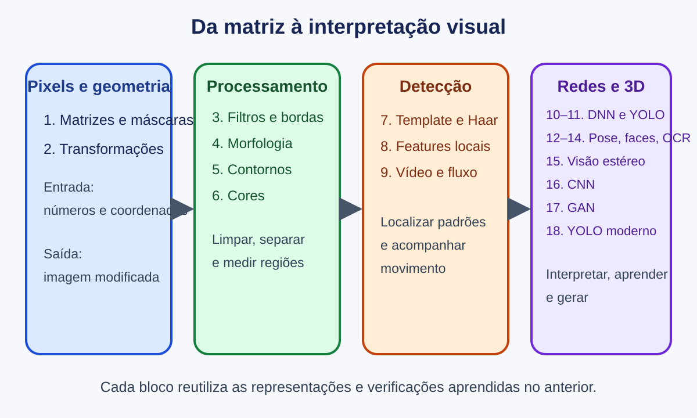

# Operações com Imagens

Este curso ensina o computador a transformar números em interpretações visuais. A ideia central é simples: **uma imagem digital é uma matriz**; tudo o que fazemos — desfocar, encontrar uma borda, reconhecer texto ou detectar uma pessoa — começa manipulando ou interpretando essa matriz.

## Como o curso progride

1. **Ver os dados:** pixels, canais, coordenadas, regiões e máscaras.
2. **Modificar os dados:** geometria, interpolação, convolução e morfologia.
3. **Extrair estrutura:** cores, contornos, pontos de interesse e movimento.
4. **Interpretar a cena:** redes neurais, detecção, pose, faces, texto e profundidade.
5. **Aprender representações:** CNNs, GANs e detectores de uma etapa.

Cada capítulo responde a cinco perguntas:

- Qual problema esta técnica resolve?
- Que intuição permite entendê-la sem decorar?
- Qual é o modelo matemático essencial?
- Como os parâmetros mudam o resultado?
- Em quais situações a técnica falha ou produz uma conclusão injustificada?

## Primeiro passo

Se você ainda não preparou o computador, siga [Preparação do ambiente](ambiente.md). Depois, comece pelo [Capítulo 1](capitulos/01-fundamentos.md), mesmo que já tenha usado OpenCV: a ordem de eixos, o tipo `uint8` e a diferença BGR/RGB explicam muitos erros dos capítulos posteriores.
